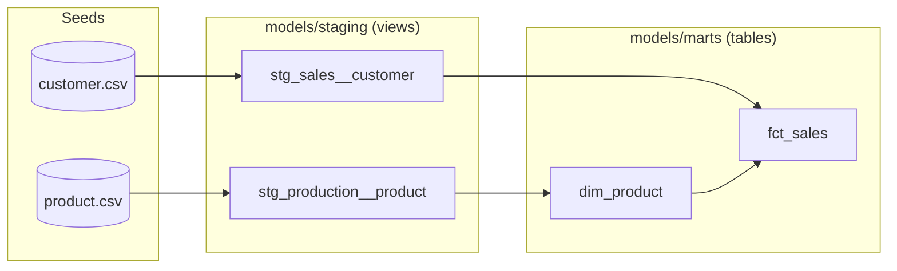
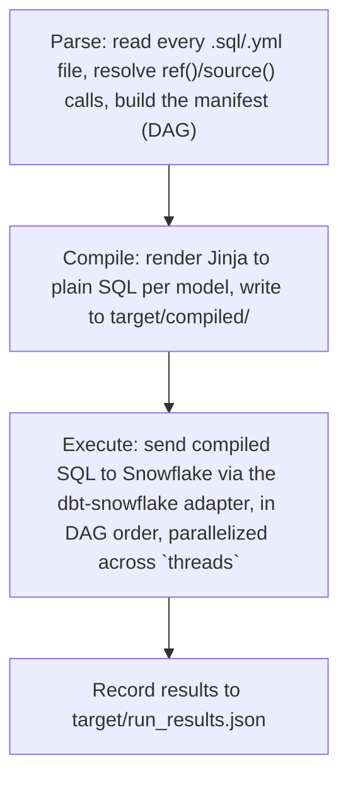

## Part 0: Introduction to dbt

Before we build anything, it helps to know what dbt actually does and how it thinks about a project. This part assumes no prior dbt experience. If you already know dbt well, feel free to skip ahead to [Part 1](part01-setup-dbt-project.md).

### 1. What dbt is

dbt (data build tool) is the "T" in ELT. In an ELT pipeline, raw data is **E**xtracted from source systems and **L**oaded into your warehouse first, in whatever shape it arrives in. Only then does the **T**ransformation happen — and that transformation step is dbt's entire job.

In this project, the "load" step is `dbt seed`: it reads the CSV files under `seeds/` and loads them into your warehouse as tables, unmodified. From that point on, dbt's job is to transform those raw, loaded tables into clean, modeled tables and views by generating plain SQL and running it against that same warehouse. dbt never moves data between systems and never sees your raw source files directly once they're seeded — it only ever talks to the warehouse.

This is the opposite of traditional ETL, where transformation happens in a separate tool *before* the data is loaded — often on a server between the source system and the warehouse. ELT (and dbt) flips that order: load first, then transform in place, using the warehouse's own compute to do the work.

It's worth being explicit about what dbt is *not*: it is not a new query language, and it doesn't execute anything itself. dbt is just SQL, plus Jinja templating (for reusability — loops, variables, macros), plus a command-line tool that reads your project, compiles your Jinja+SQL into plain SQL, and sends it to your warehouse. If you can write a `select` statement, you already know most of what you need to write a dbt model.

### 2. Project anatomy

A dbt project is a folder of SQL and YAML files with a specific, opinionated layout. Here's what each folder in this project means to dbt:

| Folder | What dbt does with it |
| --- | --- |
| `models/` | Transformation SQL. Each `.sql` file is a `select` statement that dbt turns into a view or a table in your warehouse. This project's `models/staging/` holds one-to-one cleanups of raw seed tables (e.g. `stg_production__product`), and `models/marts/` holds the joined-up, business-facing tables built on top of staging (e.g. `dim_product`). |
| `seeds/` | Small CSV files that dbt loads as tables via `dbt seed`. This is how the AdventureWorks sample data gets into your warehouse in the first place. |
| `snapshots/` | Point-in-time history. A snapshot definition tells dbt to compare a source table's current state against what it recorded last time it ran, and insert a new row whenever tracked columns change. `scd_person_snapshot.sql` in this project does this for person records. |
| `macros/` | Reusable Jinja — functions you can call from any model. This project's `generate_schema_name` override in `override_default_schema_name.sql` is a macro: it controls how dbt names schemas in the warehouse, overriding dbt's built-in default. |
| `tests/` | Custom SQL tests you write by hand (as opposed to the generic tests — like `not_null` and `unique` — that you declare in `.yml` files). A test is just a `select` statement that should return zero rows; if it returns any rows, the test fails. |
| `analyses/` | SQL that dbt will compile (resolving `ref()` calls, rendering Jinja) but never run as part of `dbt run` or `dbt build`. Useful for ad hoc queries you want version-controlled and DAG-aware without them being part of your models. |

Two configuration files are easy to confuse when you're new to dbt:

- **`dbt_project.yml`** is project-wide configuration that's committed to git along with your code. It tells dbt where to find each type of file (the `model-paths`, `seed-paths`, and so on you'll see near the top), and it sets defaults per folder — for example, this project's `dbt_project.yml` configures everything under `models/staging` to materialize as a `view` and everything under `models/marts` to materialize as a `table`, so you don't have to repeat that in every model file.
- **`profiles.yml`** holds connection credentials — account, user, password, warehouse, and so on — and normally lives *outside* the project folder that gets committed to git, precisely because it contains secrets. This repo is a bit unusual in that it commits a `profiles.yml`: every credential in it is a call to `env_var()` (e.g. `{{ env_var('DBT_SNOWFLAKE_PASSWORD') }}`), which reads the real value from your shell's environment variables at run time. Nothing sensitive is ever written into the file itself, so committing it is safe.

### 3. The DAG

dbt models don't declare their dependencies in a separate pipeline-configuration file. Instead, dependencies are wired up directly inside your SQL, using the `ref()` function. When you write:

```sql
select * from {{ ref('stg_production__product') }}
```

that line is doing two things at once. First, it's an ordinary SQL `from` clause — it pulls that model's output into a CTE (or subquery) so you can build on top of it. Second, and just as importantly, it's the *only* signal dbt needs to know that this model depends on `stg_production__product`. There is no separate DAG file to maintain — dbt scans every `ref()` (and `source()`) call in your project and builds the dependency graph from that alone. Rename a model and every `ref()` to it breaks loudly at compile time, which is exactly the safety net you want.

Here's a slice of this project's actual DAG once the staging layer is in place:



*A slice of this project's DAG — seeds feed staging views, staging feeds marts, and marts can depend on each other.*

Notice the last arrow: `dim_product` feeds into `fct_sales`. Marts can depend on other marts, not just on staging models — dbt doesn't care which folder a model lives in, only which `ref()` calls connect it to the rest of the graph.

### 4. Materializations

A materialization is *how* dbt turns your `select` statement into something that persists (or doesn't) in the warehouse. You choose a materialization per model — either as a default for a whole folder in `dbt_project.yml`, or per-file with a `{{ config(materialized='...') }}` call. This project uses two of the four:

| Materialization | What it compiles to | Used for |
| --- | --- | --- |
| `view` | `create or replace view ... as select ...` — no data is stored; the query re-runs every time something selects from it. | Staging models in this project — cheap to keep fresh since they're thin, one-to-one wrappers over seeds. |
| `table` | `create or replace table ... as select ...` — the result set is physically stored in the warehouse. | Mart models in this project — joined, business-facing tables that are worth materializing once rather than recomputing on every read. |
| `incremental` | On the first run, a full `create table as select`, same as `table`. On later runs, dbt compiles an `insert` (or `merge`) that only processes new or changed rows, instead of recomputing the whole table from scratch. | Not used yet in this project, but it's the option you reach for once a fact table gets too large to rebuild from scratch on every run. It comes up again in the SCD1 section later in this tutorial. |
| `ephemeral` | Nothing — the model is never materialized in the warehouse at all. dbt inlines its SQL as a CTE into every model that references it. | Not used in this project, but handy for thin intermediate logic you don't want cluttering the warehouse with its own object. |

### 5. What happens when you run `dbt run`

Every dbt invocation that touches models — `dbt run` is the clearest example — goes through the same three phases:



**Parse** happens first and touches every file in the project, not just the ones you asked to run: dbt has to read every model and macro, resolve every `ref()` and `source()` call, and assemble the full dependency graph (the "manifest") before it can safely run anything in the right order.

**Compile** takes each model's raw SQL-plus-Jinja and renders it down to the plain SQL that will actually be sent to the warehouse — `ref()` calls become fully qualified table names, macros get expanded, `` blocks get resolved. You can inspect the result yourself under `target/compiled/`.

**Execute** is where the compiled SQL is actually sent to Snowflake, through the `dbt-snowflake` adapter, in dependency order. This is also where `threads` matters: the `threads: 4` setting in `profiles.yml` tells dbt how many independent branches of the DAG it's allowed to execute concurrently. Two models that don't depend on each other (like two unrelated staging models) can run in parallel; a model always waits for everything it `ref()`s to finish first.

Finally, dbt **records** what happened — timing, row counts, pass/fail per model or test — to `target/run_results.json`, which is what powers commands like `dbt docs generate` and any CI reporting you might build on top of it.

### 6. Core CLI commands

All of the commands you'll use in this tutorial map onto the phases above:

- **`dbt deps`** — reads `packages.yml` and downloads the listed packages (this project uses `dbt-labs/dbt_utils`) into `dbt_packages/`. No parse/compile/execute involved; it's a dependency-installation step that has to happen before anything else can use those packages' macros.
- **`dbt seed`** — loads the CSVs under `seeds/` into the warehouse as tables. This is the "load" half of ELT, and it's how raw data gets into the warehouse for everything else in this tutorial to build on.
- **`dbt run`** — the parse → compile → execute cycle described above, applied to your models.
- **`dbt test`** — runs the tests you've declared (generic tests like `not_null`/`unique` in `.yml` files, plus any custom tests in `tests/`) as `select` statements. A test passes if it returns zero rows.
- **`dbt snapshot`** — executes the definitions under `snapshots/`, inserting a new history row only for records whose tracked columns have changed since the last snapshot run.
- **`dbt build`** — runs seeds, models, snapshots, and tests together, in DAG order, stopping downstream work if something upstream fails. It's the one-command entry point you'll reach for most often once a project is up and running.
- **`dbt docs generate`** and **`dbt docs serve`** — the first builds a documentation site from the descriptions and tests in your `.yml` files (plus the DAG itself); the second serves that site locally so you can click through it in a browser.
- **`dbt debug`** — checks that your `profiles.yml` connection details actually work (can dbt reach the warehouse, authenticate, and see the target schema). No transformation happens; it's purely a connectivity check, and it's the first thing to run when something's misconfigured.

### 7. dbt Core vs. dbt Cloud

Everything in this tutorial uses **dbt Core**: the open-source command-line tool you install yourself (`pip install dbt-snowflake` installs dbt Core plus the Snowflake adapter) and run locally, in a script, or in your own CI system.

**dbt Cloud** is a separate, hosted product from dbt Labs that layers a browser-based IDE, a job scheduler, and other UI on top of the same underlying dbt engine. It's worth knowing this distinction exists mainly so you're not thrown off if a blog post, video, or search result shows a browser-based IDE — that's dbt Cloud, not the CLI workflow this tutorial teaches, even though the models, `ref()`, materializations, and everything else you're learning here behave identically in both.

### 8. What's next

Now that you know what dbt does, the [next part](part00b-data-modeling-fundamentals.md) covers *what* we're going to ask it to build: the theory behind dimensional modelling.

[« Previous](../README.md) [Next »](part00b-data-modeling-fundamentals.md)
