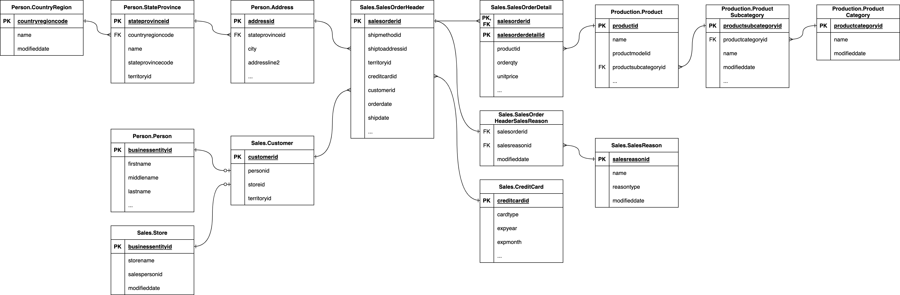
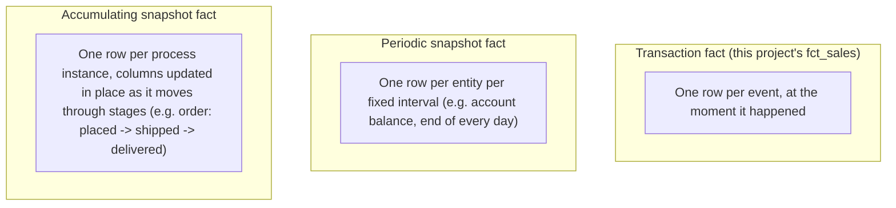
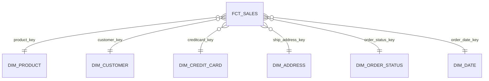

## Part 0b: Data modeling fundamentals

Part 0 covered what dbt does. Before we touch it again, it's worth spending a few minutes on *why* the models we're about to build look the way they do. This part is pure theory — no dbt commands, no SQL to run — but it explains the vocabulary and reasoning you'll see referenced throughout the rest of this tutorial: grain, fact tables, dimensions, and the star schema.

### 1. OLTP vs. OLAP

The seed data for this project — the CSVs under `seeds/`, modeled on Microsoft's AdventureWorks sample database — looks like this once it's loaded:

That's an OLTP (**On**line **T**ransaction **P**rocessing) schema: dozens of narrow, heavily normalized tables, each one representing a single real-world entity (a person, an address, a product, an order line), wired together with foreign keys. This shape exists for a good reason — it's optimized for the workload a production application actually generates: inserting or updating one row at a time, safely, without duplicating data anywhere. If a customer changes their address, that fact should be true in exactly one row, in exactly one table, so the application only has to update it once and every other table that references that customer sees the change immediately.

That's exactly the wrong shape for analytics. An analyst asking "what was our revenue by product category last quarter?" isn't touching one row — they're scanning and aggregating millions of them, and every one of those normalized foreign-key relationships is a join the warehouse has to perform along the way. OLAP (**On**line **A**nalytical **P**rocessing) workloads are optimized for the opposite thing: reading and summarizing large volumes of data, not writing single rows quickly. Dimensional modeling — the technique this whole tutorial teaches — is how you reshape an OLTP schema like the one above into something built for that OLAP workload: fewer, wider tables, denormalized on purpose, with the joins done once up front (in dbt) instead of over and over again (in every analyst's query).

### 2. Grain

If there's one decision in dimensional modeling that matters more than any other, it's the **grain**: a precise statement of what a single row in a fact table represents. Everything else — which columns belong in the table, which dimensions it can join to, whether a measure can be safely summed — follows from getting the grain right first.

In this project, `fct_sales`'s grain is **one row per sales order *line*** (each row is uniquely identified by `sales_order_id` + `sales_order_detail_id`, i.e. one row per `sales_order_detail_id`) — not one row per order. That distinction isn't cosmetic. A single order in AdventureWorks can contain several different products, each ordered at its own quantity and unit price. If the grain were coarser — one row per order — there would be nowhere to put more than one product per row, and you'd either lose the ability to say which product was sold or you'd have to invent some lossy way of squashing multiple products into a single row (concatenated lists, an arbitrary "first product," an average price). Declaring the grain at the line level up front means every measure and every dimension key on the table has one unambiguous meaning, and it's the reason `fct_sales` can join cleanly to `dim_product` at all: at the order-line grain, "the product on this row" is a well-defined question.

### 3. Fact table types

Not every fact table represents an instantaneous event the way `fct_sales` does. Kimball's methodology distinguishes three fact table types by how their rows relate to time:

`fct_sales` is a **transaction fact table**: each row is written once, when the order line happened, and is never revisited. That's the simplest and most common fact table type, and it's the only one this tutorial builds — but it's worth knowing the other two exist, because you'll run into them in real warehouses:

- A **periodic snapshot fact** takes a measurement at a fixed cadence rather than an event as it occurs. AdventureWorks doesn't build one, but imagine a `fct_inventory_snapshot` table with one row per product per day recording the on-hand quantity at that day's close — useful for answering "how much stock did we have on any given date" without having to replay every stock movement from the beginning of time.
- An **accumulating snapshot fact** has one row per instance of a multi-step process, and that row's columns get updated in place as the instance moves through its stages. A `fct_order_fulfillment` table might have one row per order with columns like `placed_date`, `shipped_date`, and `delivered_date`, each filled in — and each triggering an update to the same row — as the order progresses. Unlike the other two types, rows here are mutable by design.

### 4. Measures: additive, semi-additive, non-additive

A measure is a numeric fact table column meant to be aggregated — summed, averaged, counted — across dimensions. Not every measure behaves the same way under aggregation, and knowing which kind you're looking at matters as much as computing it correctly in the first place:

- **Additive** measures can be safely summed across *every* dimension, including time. `fct_sales.revenue` is additive: you can sum it across products, across customers, across dates, or across all of them at once, and the total is always meaningful. This is the easiest and most common kind of measure to work with.
- **Semi-additive** measures can be summed across some dimensions but not others — typically not across time. A hypothetical account-balance measure is the classic example: summing today's balance across every customer gives you a meaningful total (total funds on hand), but summing one customer's balance across every day of the month does not — that just adds the same money to itself repeatedly. Semi-additive measures usually need a specific aggregation, like "balance as of the last day of the period," rather than a plain sum.
- **Non-additive** measures can't be summed across *any* dimension without producing nonsense. A margin percentage or a unit price are typical examples: averaging or summing unit prices across ten order lines doesn't tell you anything useful. The only correct way to report a non-additive measure at a higher level of aggregation is to recompute it from its underlying additive components after they've been aggregated — e.g. sum revenue and sum cost separately, then divide, rather than averaging a bunch of pre-computed margin percentages.

### 5. Dimension patterns: conformed, degenerate, junk

Dimension tables carry the descriptive context — the "who, what, where" — that gives a fact table's measures meaning. A few recurring patterns show up often enough that they have names:

- **Conformed dimensions** are dimension tables built once and reused, unchanged, across multiple fact tables. `dim_date` and `dim_product` in this project are conformed in exactly that sense: if AdventureWorks later built a `fct_inventory` fact table to track stock levels, it could join straight to the existing `dim_product` and `dim_date` tables without modification. That reuse is one of the biggest wins of dimensional modeling — build a dimension once, get correct, consistent labels and hierarchies everywhere it's joined.
- **Degenerate dimensions** are identifier columns that live directly on the fact table, with no corresponding dimension table, because they don't describe anything beyond identifying the source transaction. `fct_sales.sales_order_id` is a degenerate dimension: it's useful for grouping order lines back into their parent order, or for tracing a row back to the source system, but it has no other attributes worth pulling into a dimension table of its own.
- **Junk dimensions** bundle several low-cardinality, otherwise-unrelated flags or indicators into one small dimension table, so the fact table needs one foreign key instead of five or six tiny ones. This project doesn't currently have one — `dim_order_status` holds a single low-cardinality attribute (order status) rather than several bundled flags, so it's an ordinary dimension rather than a junk dimension. If a future fact table needed to track several independent yes/no or small-enumeration flags at once, bundling them into a junk dimension would be the pattern to reach for.

### 6. Star vs. snowflake schema

There are two common ways to arrange dimension tables around a fact table. A **snowflake schema** keeps dimensions normalized — a dimension can reference other, smaller dimension tables, the way the original OLTP schema does — so the fact table sits at the center of a structure that branches outward in multiple normalized layers:

A **star schema** instead denormalizes each dimension down to a single flat table, pre-joining whatever normalized pieces it would otherwise be split across, so that every dimension attaches to the fact table directly:

The trade-off is straightforward: a snowflake schema saves some storage and avoids repeating descriptive text, but it pushes extra joins onto every query that needs those deeper attributes. A star schema costs a bit of redundant storage but means any consumer of the model can get from a fact row to any dimension attribute in a single join. For analytics workloads — where query simplicity and read performance matter far more than storage efficiency — the star schema almost always wins, and it's the shape this tutorial builds toward.

Here's this project's actual star schema, as a concrete, current reference for what you're about to build:

`fct_sales` sits at the center, and every dimension attaches to it through a single surrogate key — no multi-hop joins required to get from an order line to the product, customer, or date that describes it.

### 7. What's next

With the fundamentals in place, let's set up the project and start building.

[&laquo; Previous](part00-intro-to-dbt.md) [Next &raquo;](part01-setup-dbt-project.md)
