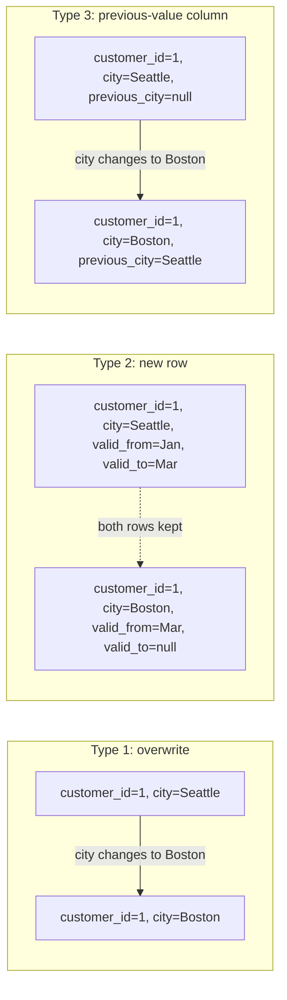
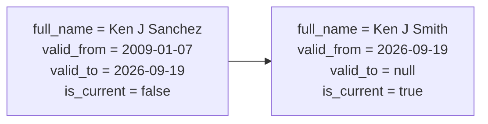

## Part 4b: Slowly changing dimensions (SCD Types 1, 2, and 3)

Every dimension we built in Part 4 answers "what does this entity look like *right now*?" But source values change: a customer moves and gets a new address, a product's name gets corrected, a person's last name changes. A **slowly changing dimension (SCD)** strategy decides what happens to the dimension table when that happens.

There are three classic strategies:

| Type | What happens on a change | History kept | Query complexity |
| --- | --- | --- | --- |
| **Type 1** | Overwrite the old value | None — only the current value exists | Simplest: one row per entity, always current |
| **Type 2** | Insert a new row, close out the old one | Full history, one row per version | Need a `valid_from`/`valid_to` (or `is_current`) filter to pick a point in time |
| **Type 3** | Add a `previous_x` column, overwrite the current one | Limited: only the immediately prior value | Simple, but can't go back more than one change |



### SCD Type 1 — overwrite (no history)

You've already built Type 1 dimensions without realizing it. Every dimension in Part 4 is materialized as a full-refresh `table`: each `dbt run` truncates and rebuilds it from the current state of the source data. If a product's name changes in `product.csv` and you re-seed and re-run, `dim_product` simply shows the new name — the old one is gone. That *is* Type 1.

Full-refresh works fine at this project's scale (a few thousand rows). At production scale (millions of rows), rebuilding the whole table on every run is wasteful, so Type 1 is usually implemented as an `incremental` model that merges only changed rows instead:

```sql
{{ config(materialized='incremental', unique_key='product_id', incremental_strategy='merge') }}

select
    product_id,
    product_name,
    product_number
from {{ ref('stg_production__product') }}


where modified_date > (select coalesce(max(modified_date), '1900-01-01') from {{ this }})

```

The `merge` strategy overwrites any row whose `unique_key` already exists — same overwrite-in-place behavior as the full-refresh table, just without touching unchanged rows.

### SCD Type 2 — full history (hands-on)

dbt has first-class support for Type 2 via [snapshots](https://docs.getdbt.com/docs/build/snapshots). A snapshot is a special kind of model that, on every `dbt snapshot` run, compares the current source data against what it captured last time and inserts a new row *only* for entities whose tracked columns changed — closing out the previous row's `dbt_valid_to` rather than overwriting it.

This project includes a working example: `adventureworks/snapshots/scd_person_snapshot.sql` tracks the `person` table (via `stg_person__person`) using a `timestamp` strategy against its `modified_date` column, and `adventureworks/models/marts/dim_customer_scd2.sql` builds a historized customer dimension on top of it.

Try it yourself:

1. Run the full pipeline once:
   ```
   dbt seed && dbt snapshot && dbt run
   ```
   Query `dim_customer_scd2` for any one `customer_id` — you'll see exactly one row, with `valid_to` null and `is_current` true.
2. Simulate a real-world change: open `adventureworks/seeds/person/person.csv`, pick a row, change its `lastname`, and bump its `modifieddate` to a later timestamp (e.g. today's date).
3. Re-run the pipeline:
   ```
   dbt seed && dbt snapshot && dbt run
   ```
4. Query `dim_customer_scd2` for that same `customer_id` again. You now see **two** rows: the original, with `valid_to` set to the timestamp you just used and `is_current` false, and a new row with the updated name, `valid_to` null, and `is_current` true.


*Two rows for the same `customer_id` in `dim_customer_scd2` after simulating a name change — this is what Type 2 history looks like.*

This is exactly why the snapshot's `unique_key` (`business_entity_id`) matters: it's how dbt knows these two rows are different *versions of the same entity*, not two different people.

### SCD Type 3 — limited history (previous-value column)

Type 3 is a middle ground: instead of a new row, you add a `previous_x` column that remembers only the value immediately before the current one. It's cheap to query (still one row per entity) but can't answer "what was this three changes ago?" — only "what was this right before now?"

There's no dedicated dbt feature for Type 3 (unlike snapshots for Type 2); it's typically hand-rolled as a self-referencing incremental model that compares the incoming row to what's already in the table (`{{ this }}`):

```sql
{{ config(materialized='incremental', unique_key='address_id') }}

with source as (
    select address_id, city_name, modified_date
    from {{ ref('stg_person__address') }}
),


existing as (
    select address_id, city_name as previous_city_name
    from {{ this }}
),

final as (
    select
        source.address_id,
        source.city_name,
        case
            when existing.city_name is distinct from source.city_name then existing.city_name
            else existing.previous_city_name
        end as previous_city_name
    from source
    left join existing using (address_id)
)

final as (
    select address_id, city_name, cast(null as varchar) as previous_city_name
    from source
)


select * from final
```

The key idea: `previous_city_name` only updates when `city_name` actually changed since the last run — otherwise it keeps carrying forward whatever it already held.

### Choosing between them

- Use **Type 1** for corrections (typos, data-quality fixes) where the old value was simply wrong and history has no value.
- Use **Type 2** whenever "what did this look like at the time of the transaction" matters for reporting — e.g. you want `fct_sales` to join to the customer's address *as of the order date*, not their current address.
- Use **Type 3** for the rare case where you specifically need "current vs. immediately-previous" (e.g. "customers who moved this quarter") and don't need deeper history.

[&laquo; Previous](part04-create-dimension.md) [Next &raquo;](part05-create-fact.md)
