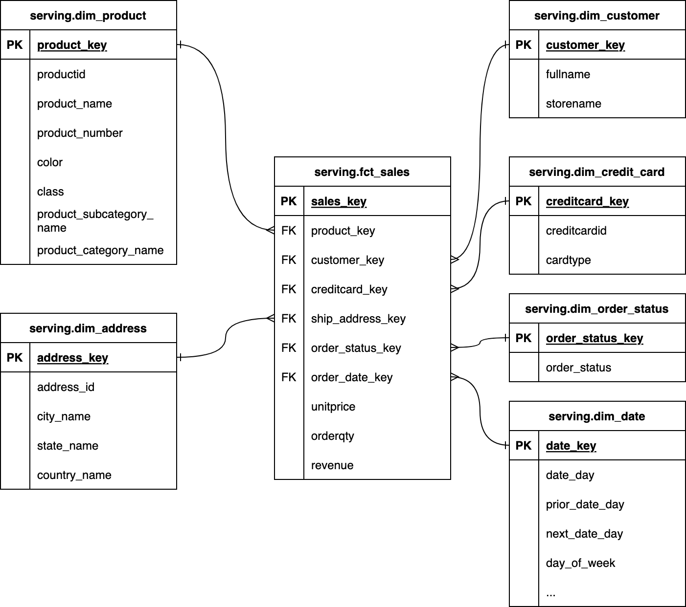

## Part 6: Document the dimensional model relationships

Let’s make it easier for consumers of our dimensional model to understand the relationships between tables by creating an [Entity Relationship Diagram (ERD)](https://www.visual-paradigm.com/guide/data-modeling/what-is-entity-relationship-diagram/). 

*Final dimensional model ERD*

The ERD will enable consumers of our dimensional model to quickly identify the keys and relationship type (one-to-one, one-to-many) that need to be used to join tables. 

Note that this ERD shows the `marts` layer only — the `staging` models sitting underneath each dimension and the fact table are an internal implementation detail, not something the consumers of the dimensional model need to know about.

[&laquo; Previous](part05-create-fact.md) [Next &raquo;](part07-consume-model.md)
