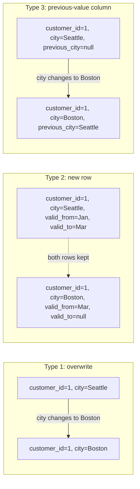
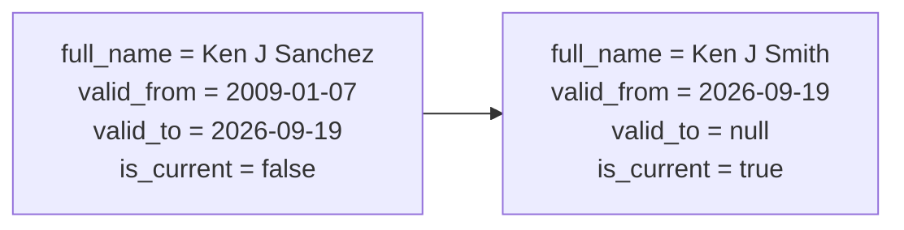

# Snowflake / Staging Layer / SCD1-2-3 Modernization Implementation Plan

> **For agentic workers:** REQUIRED SUB-SKILL: Use superpowers:subagent-driven-development (recommended) or superpowers:executing-plans to implement this plan task-by-task. Steps use checkbox (`- [ ]`) syntax for tracking.

**Goal:** Modernize the `adventureworks` dbt project (Snowflake-only, staging layer, current package/version conventions) and expand the tutorial docs with an intro-to-dbt lesson, data-modeling fundamentals, and a working SCD1/2/3 lesson.

**Architecture:** Insert a `models/staging/` layer between seeds and `models/marts/` that renames raw AdventureWorks columns (e.g. `productid`, `orderdate`) to clean snake_case business names (`product_id`, `order_date`); update every mart to consume staging models instead of seeds directly, using the new column names throughout; add a dbt snapshot + a `dim_customer_scd2` mart as a real, runnable SCD2 example; extend `docs/` with two new pre-hands-on lessons (`part00-intro-to-dbt.md`, `part00b-data-modeling-fundamentals.md`) and one new mid-tutorial lesson (`part04b-slowly-changing-dimensions.md`), updating existing docs in place where code/refs changed.

**Tech Stack:** dbt Core (Snowflake adapter), dbt_utils, Mermaid (in-markdown diagrams), PyYAML (local syntax validation only — no dbt/network available in the build sandbox).

## Global Constraints

- **No intermediate (`int_`) model layer.** Staging → marts only.
- **Snowflake only.** No DuckDB/Postgres branches anywhere (code, docs, or deps).
- **SCD1 and SCD3 are docs-and-snippet only** — do not add new pipeline models for them. Only SCD2 gets a real, runnable model + snapshot.
- **No renumbering of `part01`–`part07`.** New docs are `part00-*`, `part00b-*`, `part04b-*`, spliced in via nav-link edits.
- **This sandbox has no network access** (no PyPI, no dbt Hub, no live Snowflake, and `dbt` is not installed locally). Every task's verification step is therefore either (a) a PyYAML syntax check, (b) `grep`-based structural checks, or (c) an explicit manual review checklist — never `dbt run`/`dbt test`/`dbt parse`. Do not attempt to install or invoke `dbt` in this environment.
- **Version pins use ranges, not exact versions**, because exact latest versions can't be verified offline. Each range gets a comment telling the human to confirm before installing.
- Every renamed column must be updated **consistently** across: the staging model that defines it, every mart that consumes it, that mart's `.yml` doc/tests, and any docs code block that shows it. Tasks below spell out the exact old→new mapping per file — follow it exactly, don't improvise alternate names.
- The existing `data_tests`/`tests` split: dbt-core has deprecated the top-level `tests:` key on model/seed columns in favor of `data_tests:`. **All new YAML in this plan uses `data_tests:`.** Existing files being edited must be converted from `tests:` to `data_tests:` as part of that edit.

---

### Task 1: Snowflake-only config, dependency ranges, and staging materialization config

**Files:**
- Modify: `adventureworks/requirements.txt` (repo root: `requirements.txt` — confirm path with `find . -name requirements.txt` first; there is exactly one, at the repo root, used for the whole `adventureworks/` project)
- Modify: `adventureworks/packages.yml`
- Modify: `adventureworks/profiles.yml`
- Modify: `.sqlfluff` (repo root)
- Modify: `adventureworks/dbt_project.yml`

**Interfaces:**
- Produces: `staging` schema config (`+materialized: view`, `+schema: staging` under `models.adventureworks.staging` in `dbt_project.yml`) that Tasks 2–5 rely on.
- Produces: `env_var()`-based Snowflake credentials in `profiles.yml` that `docs/part01` (Task 12) documents how to set.

- [ ] **Step 1: Rewrite `requirements.txt`**

Replace the entire file contents with:

```
# dbt-snowflake pulls in a matching dbt-core version automatically; do not
# pin dbt-core separately. Verify these are still the latest minor lines at
# https://pypi.org/project/dbt-snowflake/ and https://pypi.org/project/sqlfluff/
# before installing, since this was written without live network access.
dbt-snowflake>=1.8.0,<2.0.0
sqlfluff>=3.0.0,<4.0.0
sqlfluff-templater-dbt>=3.0.0,<4.0.0
```

- [ ] **Step 2: Rewrite `adventureworks/packages.yml`**

```yaml
packages:
  - package: dbt-labs/dbt_utils
    version: [">=1.3.0", "<2.0.0"]
```

- [ ] **Step 3: Rewrite `adventureworks/profiles.yml`**

```yaml
adventureworks:
  target: dev
  outputs:
    dev:
      type: snowflake
      account: "{{ env_var('DBT_SNOWFLAKE_ACCOUNT') }}"

      # User/password auth. See docs/part01-setup-dbt-project.md for
      # key-pair auth as an alternative to a plaintext password.
      user: "{{ env_var('DBT_SNOWFLAKE_USER') }}"
      password: "{{ env_var('DBT_SNOWFLAKE_PASSWORD') }}"

      role: "{{ env_var('DBT_SNOWFLAKE_ROLE', 'dbt_role') }}"
      database: "{{ env_var('DBT_SNOWFLAKE_DATABASE', 'dbt_db') }}"
      warehouse: "{{ env_var('DBT_SNOWFLAKE_WAREHOUSE', 'dbt_wh') }}"
      schema: "{{ env_var('DBT_SNOWFLAKE_SCHEMA', 'dbt_schema') }}"
      threads: 4
      client_session_keep_alive: False

      # optional
      connect_retries: 0 # default 0
      connect_timeout: 10 # default: 10
      retry_on_database_errors: False # default: false
      retry_all: False  # default: false
      reuse_connections: False
```

- [ ] **Step 4: Rewrite `.sqlfluff`**

```ini
[sqlfluff]
templater = dbt
dialect = snowflake
exclude_rules = L016,L028,L027

[sqlfluff:templater:dbt]
project_dir = adventureworks
profiles_dir = adventureworks
target = dev
```

- [ ] **Step 5: Add staging config to `adventureworks/dbt_project.yml`**

Change the `models:` block at the end of the file from:

```yaml
models:
  adventureworks:
    marts:
      +materialized: table
      +schema: marts
```

to:

```yaml
models:
  adventureworks:
    staging:
      +materialized: view
      +schema: staging
    marts:
      +materialized: table
      +schema: marts
```

- [ ] **Step 6: Verify YAML/INI syntax**

Run each of:
```bash
python3 -c "import yaml; yaml.safe_load(open('adventureworks/packages.yml'))"
python3 -c "import yaml; yaml.safe_load(open('adventureworks/profiles.yml'))"
python3 -c "import yaml; yaml.safe_load(open('adventureworks/dbt_project.yml'))"
```
Expected: no output, exit code 0 for all three (a parse error will raise and print a traceback).

For `.sqlfluff`, run `python3 -c "import configparser; c = configparser.ConfigParser(); c.read('.sqlfluff'); print(c.sections())"` — expected output: `['sqlfluff', 'sqlfluff:templater:dbt']`.

- [ ] **Step 7: Commit**

```bash
git add requirements.txt adventureworks/packages.yml adventureworks/profiles.yml .sqlfluff adventureworks/dbt_project.yml
git commit -m "Migrate to Snowflake-only deps/config and add staging layer materialization config"
```

---

### Task 2: Staging models — `person` schema

**Files:**
- Create: `adventureworks/models/staging/person/stg_person__person.sql`
- Create: `adventureworks/models/staging/person/stg_person__address.sql`
- Create: `adventureworks/models/staging/person/stg_person__stateprovince.sql`
- Create: `adventureworks/models/staging/person/stg_person__countryregion.sql`
- Create: `adventureworks/models/staging/person/_person__models.yml`

**Interfaces:**
- Consumes: seeds `person`, `address`, `stateprovince`, `countryregion` (all referenced today by the marts these staging models will replace).
- Produces (columns other tasks will `ref()` and select by these exact names):
  - `stg_person__person`: `business_entity_id, title, first_name, middle_name, last_name, person_type, name_style, suffix, modified_date, row_guid, email_promotion`
  - `stg_person__address`: `address_id, address_line_1, address_line_2, city_name, state_province_id, postal_code, spatial_location, row_guid, modified_date`
  - `stg_person__stateprovince`: `state_province_id, country_region_code, state_name, territory_id, is_only_state_province_flag, state_province_code, row_guid, modified_date`
  - `stg_person__countryregion`: `country_region_code, country_name, modified_date`

- [ ] **Step 1: Create the four staging models**

`adventureworks/models/staging/person/stg_person__person.sql`:
```sql
select
    businessentityid as business_entity_id,
    title,
    firstname as first_name,
    middlename as middle_name,
    lastname as last_name,
    persontype as person_type,
    namestyle as name_style,
    suffix,
    modifieddate as modified_date,
    rowguid as row_guid,
    emailpromotion as email_promotion
from {{ ref('person') }}
```

`adventureworks/models/staging/person/stg_person__address.sql`:
```sql
select
    addressid as address_id,
    addressline1 as address_line_1,
    addressline2 as address_line_2,
    city as city_name,
    stateprovinceid as state_province_id,
    postalcode as postal_code,
    spatiallocation as spatial_location,
    rowguid as row_guid,
    modifieddate as modified_date
from {{ ref('address') }}
```

`adventureworks/models/staging/person/stg_person__stateprovince.sql`:
```sql
select
    stateprovinceid as state_province_id,
    countryregioncode as country_region_code,
    name as state_name,
    territoryid as territory_id,
    isonlystateprovinceflag as is_only_state_province_flag,
    stateprovincecode as state_province_code,
    rowguid as row_guid,
    modifieddate as modified_date
from {{ ref('stateprovince') }}
```

`adventureworks/models/staging/person/stg_person__countryregion.sql`:
```sql
select
    countryregioncode as country_region_code,
    name as country_name,
    modifieddate as modified_date
from {{ ref('countryregion') }}
```

- [ ] **Step 2: Create `_person__models.yml`**

```yaml
version: 2

models:
  - name: stg_person__person
    description: Cleaned, renamed pass-through of the person seed.
    columns:
      - name: business_entity_id
        description: The natural key of the person.
        data_tests:
          - not_null
          - unique
      - name: modified_date
        data_tests:
          - not_null

  - name: stg_person__address
    description: Cleaned, renamed pass-through of the address seed.
    columns:
      - name: address_id
        description: The natural key of the address.
        data_tests:
          - not_null
          - unique
      - name: state_province_id
        data_tests:
          - not_null
      - name: modified_date
        data_tests:
          - not_null

  - name: stg_person__stateprovince
    description: Cleaned, renamed pass-through of the stateprovince seed.
    columns:
      - name: state_province_id
        description: The natural key of the state/province.
        data_tests:
          - not_null
          - unique
      - name: country_region_code
        data_tests:
          - not_null

  - name: stg_person__countryregion
    description: Cleaned, renamed pass-through of the countryregion seed.
    columns:
      - name: country_region_code
        description: The natural key of the country/region.
        data_tests:
          - not_null
          - unique
      - name: country_name
        data_tests:
          - not_null
```

- [ ] **Step 3: Verify**

```bash
python3 -c "import yaml; yaml.safe_load(open('adventureworks/models/staging/person/_person__models.yml'))"
```
Expected: exit code 0.

Manual checklist (no dbt available to compile):
- [ ] Every `{{ ref('x') }}` target (`person`, `address`, `stateprovince`, `countryregion`) matches an existing seed name under `adventureworks/seeds/person/`.
- [ ] Every column in each `select` list exists in the corresponding seed's CSV header (cross-check against `adventureworks/seeds/person/*.csv` header rows).
- [ ] No two `as` aliases collide within the same model.
- [ ] Every column name referenced in `_person__models.yml` (`business_entity_id`, `address_id`, `state_province_id`, `country_region_code`, `modified_date`, `country_name`) is produced by the matching model's `select` list above.

- [ ] **Step 4: Commit**

```bash
git add adventureworks/models/staging/person/
git commit -m "Add person staging models"
```

---

### Task 3: Staging models — `production` schema

**Files:**
- Create: `adventureworks/models/staging/production/stg_production__product.sql`
- Create: `adventureworks/models/staging/production/stg_production__productsubcategory.sql`
- Create: `adventureworks/models/staging/production/stg_production__productcategory.sql`
- Create: `adventureworks/models/staging/production/_production__models.yml`

**Interfaces:**
- Consumes: seeds `product`, `productsubcategory`, `productcategory`.
- Produces:
  - `stg_production__product`: `product_id, product_name, product_number, product_color, product_class, product_subcategory_id, product_line, standard_cost, list_price, safety_stock_level, reorder_point, make_flag, finished_goods_flag, days_to_manufacture, weight, weight_unit_measure_code, sell_start_date, product_model_id, row_guid, modified_date`
  - `stg_production__productsubcategory`: `product_subcategory_id, product_category_id, product_subcategory_name, modified_date`
  - `stg_production__productcategory`: `product_category_id, product_category_name, modified_date`

- [ ] **Step 1: Create the three staging models**

`adventureworks/models/staging/production/stg_production__product.sql`:
```sql
select
    productid as product_id,
    name as product_name,
    productnumber as product_number,
    color as product_color,
    class as product_class,
    productsubcategoryid as product_subcategory_id,
    productline as product_line,
    standardcost as standard_cost,
    listprice as list_price,
    safetystocklevel as safety_stock_level,
    reorderpoint as reorder_point,
    makeflag as make_flag,
    finishedgoodsflag as finished_goods_flag,
    daystomanufacture as days_to_manufacture,
    weight,
    weightunitmeasurecode as weight_unit_measure_code,
    sellstartdate as sell_start_date,
    productmodelid as product_model_id,
    rowguid as row_guid,
    modifieddate as modified_date
from {{ ref('product') }}
```

`adventureworks/models/staging/production/stg_production__productsubcategory.sql`:
```sql
select
    productsubcategoryid as product_subcategory_id,
    productcategoryid as product_category_id,
    name as product_subcategory_name,
    modifieddate as modified_date
from {{ ref('productsubcategory') }}
```

`adventureworks/models/staging/production/stg_production__productcategory.sql`:
```sql
select
    productcategoryid as product_category_id,
    name as product_category_name,
    modifieddate as modified_date
from {{ ref('productcategory') }}
```

- [ ] **Step 2: Create `_production__models.yml`**

```yaml
version: 2

models:
  - name: stg_production__product
    description: Cleaned, renamed pass-through of the product seed.
    columns:
      - name: product_id
        description: The natural key of the product.
        data_tests:
          - not_null
          - unique
      - name: product_name
        data_tests:
          - not_null
      - name: product_subcategory_id

  - name: stg_production__productsubcategory
    description: Cleaned, renamed pass-through of the productsubcategory seed.
    columns:
      - name: product_subcategory_id
        description: The natural key of the product subcategory.
        data_tests:
          - not_null
          - unique
      - name: product_category_id
        data_tests:
          - not_null
      - name: product_subcategory_name
        data_tests:
          - not_null

  - name: stg_production__productcategory
    description: Cleaned, renamed pass-through of the productcategory seed.
    columns:
      - name: product_category_id
        description: The natural key of the product category.
        data_tests:
          - not_null
          - unique
      - name: product_category_name
        data_tests:
          - not_null
```

- [ ] **Step 3: Verify**

```bash
python3 -c "import yaml; yaml.safe_load(open('adventureworks/models/staging/production/_production__models.yml'))"
```
Expected: exit code 0.

Manual checklist: same four checks as Task 2 Step 3, applied to these three models and `adventureworks/seeds/production/*.csv`.

- [ ] **Step 4: Commit**

```bash
git add adventureworks/models/staging/production/
git commit -m "Add production staging models"
```

---

### Task 4: Staging models — `sales` schema

**Files:**
- Create: `adventureworks/models/staging/sales/stg_sales__customer.sql`
- Create: `adventureworks/models/staging/sales/stg_sales__store.sql`
- Create: `adventureworks/models/staging/sales/stg_sales__creditcard.sql`
- Create: `adventureworks/models/staging/sales/stg_sales__salesorderheader.sql`
- Create: `adventureworks/models/staging/sales/stg_sales__salesorderdetail.sql`
- Create: `adventureworks/models/staging/sales/stg_sales__salesreason.sql`
- Create: `adventureworks/models/staging/sales/stg_sales__salesorderheadersalesreason.sql`
- Create: `adventureworks/models/staging/sales/_sales__models.yml`

**Interfaces:**
- Consumes: seeds `customer`, `store`, `creditcard`, `salesorderheader`, `salesorderdetail`, `salesreason`, `salesorderheadersalesreason`.
- Produces:
  - `stg_sales__customer`: `customer_id, person_id, store_id, territory_id`
  - `stg_sales__store`: `business_entity_id, store_name, salesperson_id, modified_date`
  - `stg_sales__creditcard`: `credit_card_id, card_type, card_number, exp_month, exp_year, modified_date`
  - `stg_sales__salesorderheader`: `sales_order_id, customer_id, credit_card_id, bill_to_address_id, ship_to_address_id, ship_method_id, salesperson_id, territory_id, order_status, order_date (cast to date), due_date, ship_date, online_order_flag, subtotal, tax_amt, freight, total_due, account_number, credit_card_approval_code, currency_rate_id, revision_number, row_guid, modified_date`
  - `stg_sales__salesorderdetail`: `sales_order_id, sales_order_detail_id, product_id, special_offer_id, order_qty, unit_price, unit_price_discount, row_guid, modified_date` (no `revenue` here — that calculation is business logic and belongs in `fct_sales`, Task 8)
  - `stg_sales__salesreason`: `sales_reason_id, sales_reason_name, reason_type, modified_date`
  - `stg_sales__salesorderheadersalesreason`: `sales_order_id, sales_reason_id, modified_date`

- [ ] **Step 1: Create the seven staging models**

`adventureworks/models/staging/sales/stg_sales__customer.sql`:
```sql
select
    customerid as customer_id,
    personid as person_id,
    storeid as store_id,
    territoryid as territory_id
from {{ ref('customer') }}
```

`adventureworks/models/staging/sales/stg_sales__store.sql`:
```sql
select
    businessentityid as business_entity_id,
    storename as store_name,
    salespersonid as salesperson_id,
    modifieddate as modified_date
from {{ ref('store') }}
```

`adventureworks/models/staging/sales/stg_sales__creditcard.sql`:
```sql
select
    creditcardid as credit_card_id,
    cardtype as card_type,
    cardnumber as card_number,
    expmonth as exp_month,
    expyear as exp_year,
    modifieddate as modified_date
from {{ ref('creditcard') }}
```

`adventureworks/models/staging/sales/stg_sales__salesorderheader.sql`:
```sql
select
    salesorderid as sales_order_id,
    customerid as customer_id,
    creditcardid as credit_card_id,
    billtoaddressid as bill_to_address_id,
    shiptoaddressid as ship_to_address_id,
    shipmethodid as ship_method_id,
    salespersonid as salesperson_id,
    territoryid as territory_id,
    status as order_status,
    cast(orderdate as date) as order_date,
    duedate as due_date,
    shipdate as ship_date,
    onlineorderflag as online_order_flag,
    subtotal,
    taxamt as tax_amt,
    freight,
    totaldue as total_due,
    accountnumber as account_number,
    creditcardapprovalcode as credit_card_approval_code,
    currencyrateid as currency_rate_id,
    revisionnumber as revision_number,
    rowguid as row_guid,
    modifieddate as modified_date
from {{ ref('salesorderheader') }}
```

`adventureworks/models/staging/sales/stg_sales__salesorderdetail.sql`:
```sql
select
    salesorderid as sales_order_id,
    salesorderdetailid as sales_order_detail_id,
    productid as product_id,
    specialofferid as special_offer_id,
    orderqty as order_qty,
    unitprice as unit_price,
    unitpricediscount as unit_price_discount,
    rowguid as row_guid,
    modifieddate as modified_date
from {{ ref('salesorderdetail') }}
```

`adventureworks/models/staging/sales/stg_sales__salesreason.sql`:
```sql
select
    salesreasonid as sales_reason_id,
    name as sales_reason_name,
    reasontype as reason_type,
    modifieddate as modified_date
from {{ ref('salesreason') }}
```

`adventureworks/models/staging/sales/stg_sales__salesorderheadersalesreason.sql`:
```sql
select
    salesorderid as sales_order_id,
    salesreasonid as sales_reason_id,
    modifieddate as modified_date
from {{ ref('salesorderheadersalesreason') }}
```

- [ ] **Step 2: Create `_sales__models.yml`**

```yaml
version: 2

models:
  - name: stg_sales__customer
    description: Cleaned, renamed pass-through of the customer seed.
    columns:
      - name: customer_id
        description: The natural key of the customer.
        data_tests:
          - not_null
          - unique

  - name: stg_sales__store
    description: Cleaned, renamed pass-through of the store seed.
    columns:
      - name: business_entity_id
        description: The natural key of the store.
        data_tests:
          - not_null
          - unique
      - name: store_name
        data_tests:
          - not_null

  - name: stg_sales__creditcard
    description: Cleaned, renamed pass-through of the creditcard seed.
    columns:
      - name: credit_card_id
        description: The natural key of the credit card.
        data_tests:
          - not_null
          - unique
      - name: card_type
        data_tests:
          - not_null

  - name: stg_sales__salesorderheader
    description: Cleaned, renamed pass-through of the salesorderheader seed.
    columns:
      - name: sales_order_id
        description: The natural key of the sales order header.
        data_tests:
          - not_null
          - unique
      - name: customer_id
        data_tests:
          - not_null
      - name: order_date
        data_tests:
          - not_null
      - name: order_status
        data_tests:
          - not_null

  - name: stg_sales__salesorderdetail
    description: Cleaned, renamed pass-through of the salesorderdetail seed.
    columns:
      - name: sales_order_detail_id
        description: The natural key of the sales order detail.
        data_tests:
          - not_null
          - unique
      - name: sales_order_id
        data_tests:
          - not_null
      - name: product_id
        data_tests:
          - not_null
      - name: unit_price
        data_tests:
          - not_null
      - name: order_qty
        data_tests:
          - not_null

  - name: stg_sales__salesreason
    description: Cleaned, renamed pass-through of the salesreason seed.
    columns:
      - name: sales_reason_id
        description: The natural key of the sales reason.
        data_tests:
          - not_null
          - unique
      - name: sales_reason_name
        data_tests:
          - not_null

  - name: stg_sales__salesorderheadersalesreason
    description: Cleaned, renamed pass-through of the salesorderheadersalesreason bridge seed.
    columns:
      - name: sales_order_id
        data_tests:
          - not_null
      - name: sales_reason_id
        data_tests:
          - not_null
```

- [ ] **Step 3: Verify**

```bash
python3 -c "import yaml; yaml.safe_load(open('adventureworks/models/staging/sales/_sales__models.yml'))"
```
Expected: exit code 0.

Manual checklist: same four checks as Task 2 Step 3, applied to these seven models and `adventureworks/seeds/sales/*.csv`. Pay particular attention to `stg_sales__salesorderheader` — it has the most columns of any staging model in this project.

- [ ] **Step 4: Commit**

```bash
git add adventureworks/models/staging/sales/
git commit -m "Add sales staging models"
```

---

### Task 5: Staging model — `date` schema

**Files:**
- Create: `adventureworks/models/staging/date/stg_date__date.sql`
- Create: `adventureworks/models/staging/date/_date__models.yml`

**Interfaces:**
- Consumes: seed `date`.
- Produces: `stg_date__date`: `date_day, prior_date_day, next_date_day, prior_year_date_day, prior_year_over_year_date_day, day_of_week, day_of_week_name, day_of_month, day_of_year` (unchanged names — already clean snake_case in the seed).

- [ ] **Step 1: Create the staging model**

`adventureworks/models/staging/date/stg_date__date.sql`:
```sql
select
    date_day,
    prior_date_day,
    next_date_day,
    prior_year_date_day,
    prior_year_over_year_date_day,
    day_of_week,
    day_of_week_name,
    day_of_month,
    day_of_year
from {{ ref('date') }}
```

- [ ] **Step 2: Create `_date__models.yml`**

```yaml
version: 2

models:
  - name: stg_date__date
    description: Cleaned pass-through of the date spine seed.
    columns:
      - name: date_day
        description: The natural key of the date table.
        data_tests:
          - not_null
          - unique
```

- [ ] **Step 3: Verify**

```bash
python3 -c "import yaml; yaml.safe_load(open('adventureworks/models/staging/date/_date__models.yml'))"
```
Expected: exit code 0. Manually confirm all 9 columns in the `select` list match the header of `adventureworks/seeds/date/date.csv`.

- [ ] **Step 4: Commit**

```bash
git add adventureworks/models/staging/date/
git commit -m "Add date staging model"
```

---

### Task 6: Marts rewrite — `dim_product`, `dim_address`

**Files:**
- Modify: `adventureworks/models/marts/dim_product.sql`
- Modify: `adventureworks/models/marts/dim_product.yml`
- Modify: `adventureworks/models/marts/dim_address.sql`
- Modify: `adventureworks/models/marts/dim_address.yml`

**Interfaces:**
- Consumes: `stg_production__product`, `stg_production__productsubcategory`, `stg_production__productcategory` (Task 3); `stg_person__address`, `stg_person__stateprovince`, `stg_person__countryregion` (Task 2).
- Produces: `dim_product(product_key, product_id, product_name, product_number, product_color, product_class, product_subcategory_name, product_category_name)`; `dim_address(address_key, address_id, city_name, state_name, country_name)` — both used by `fct_sales`/`obt_sales` joins and by `docs/part07`.

- [ ] **Step 1: Rewrite `dim_product.sql`**

```sql
with stg_product as (
    select *
    from {{ ref('stg_production__product') }}
),

stg_product_subcategory as (
    select *
    from {{ ref('stg_production__productsubcategory') }}
),

stg_product_category as (
    select *
    from {{ ref('stg_production__productcategory') }}
)

select
    {{ dbt_utils.generate_surrogate_key(['stg_product.product_id']) }} as product_key,
    stg_product.product_id,
    stg_product.product_name,
    stg_product.product_number,
    stg_product.product_color,
    stg_product.product_class,
    stg_product_subcategory.product_subcategory_name,
    stg_product_category.product_category_name
from stg_product
left join stg_product_subcategory on stg_product.product_subcategory_id = stg_product_subcategory.product_subcategory_id
left join stg_product_category on stg_product_subcategory.product_category_id = stg_product_category.product_category_id
```

- [ ] **Step 2: Rewrite `dim_product.yml`**

```yaml
version: 2

models:
  - name: dim_product
    columns:
      - name: product_key
        description: The surrogate key of the product
        data_tests:
          - not_null
          - unique
      - name: product_id
        description: The natural key of the product
        data_tests:
          - not_null
          - unique
      - name: product_name
        description: The product name
        data_tests:
          - not_null
```

- [ ] **Step 3: Rewrite `dim_address.sql`**

```sql
with stg_address as (
    select *
    from {{ ref('stg_person__address') }}
),

stg_stateprovince as (
    select *
    from {{ ref('stg_person__stateprovince') }}
),

stg_countryregion as (
    select *
    from {{ ref('stg_person__countryregion') }}
)

select
    {{ dbt_utils.generate_surrogate_key(['stg_address.address_id']) }} as address_key,
    stg_address.address_id,
    stg_address.city_name,
    stg_stateprovince.state_name,
    stg_countryregion.country_name
from stg_address
left join stg_stateprovince on stg_address.state_province_id = stg_stateprovince.state_province_id
left join stg_countryregion on stg_stateprovince.country_region_code = stg_countryregion.country_region_code
```

- [ ] **Step 4: Rewrite `dim_address.yml`**

```yaml
version: 2

models:
  - name: dim_address
    columns:
      - name: address_key
        description: The surrogate key of the addressid
        data_tests:
          - not_null
          - unique

      - name: address_id
        description: The natural key
        data_tests:
          - not_null
          - unique

      - name: city_name
        description: The city name

      - name: state_name
        description: The state name

      - name: country_name
        description: The country name
```

- [ ] **Step 5: Verify**

```bash
python3 -c "import yaml; yaml.safe_load(open('adventureworks/models/marts/dim_product.yml'))"
python3 -c "import yaml; yaml.safe_load(open('adventureworks/models/marts/dim_address.yml'))"
grep -n "tests:" adventureworks/models/marts/dim_product.yml adventureworks/models/marts/dim_address.yml
```
Expected: both `python3` commands exit 0; the `grep` prints nothing (confirms no leftover bare `tests:` key — everything is `data_tests:`).

Manual checklist:
- [ ] `dim_product.sql` no longer references `{{ ref('product') }}`, `{{ ref('productsubcategory') }}`, or `{{ ref('productcategory') }}` — only the `stg_production__*` staging models.
- [ ] `dim_address.sql` no longer references `{{ ref('address') }}`, `{{ ref('stateprovince') }}`, or `{{ ref('countryregion') }}` — only the `stg_person__*` staging models.
- [ ] No occurrences of the old raw column names (`productid`, `productsubcategoryid`, `productcategoryid`, `addressid`, `stateprovinceid`, `countryregioncode`) remain in either `.sql` file — run `grep -nE "productid|productsubcategoryid|productcategoryid|addressid|stateprovinceid|countryregioncode" adventureworks/models/marts/dim_product.sql adventureworks/models/marts/dim_address.sql` and confirm no output.

- [ ] **Step 6: Commit**

```bash
git add adventureworks/models/marts/dim_product.sql adventureworks/models/marts/dim_product.yml adventureworks/models/marts/dim_address.sql adventureworks/models/marts/dim_address.yml
git commit -m "Point dim_product and dim_address at staging models with renamed columns"
```

---

### Task 7: Marts rewrite — `dim_customer`, `dim_credit_card`, `dim_order_status`, `dim_date`

**Files:**
- Modify: `adventureworks/models/marts/dim_customer.sql`, `dim_customer.yml`
- Modify: `adventureworks/models/marts/dim_credit_card.sql`, `dim_credit_card.yml`
- Modify: `adventureworks/models/marts/dim_order_status.sql`, `dim_order_status.yml`
- Modify: `adventureworks/models/marts/dim_date.sql`, `dim_date.yml`

**Interfaces:**
- Consumes: `stg_sales__customer`, `stg_person__person`, `stg_sales__store` (dim_customer); `stg_sales__salesorderheader`, `stg_sales__creditcard` (dim_credit_card); `stg_sales__salesorderheader` (dim_order_status); `stg_date__date` (dim_date).
- Produces: `dim_customer(customer_key, customer_id, business_entity_id, full_name, store_business_entity_id, store_name)`; `dim_credit_card(creditcard_key, credit_card_id, card_type)`; `dim_order_status(order_status_key, order_status, order_status_name)` (unchanged column names — `order_status` was already the alias in the old `fct_sales.sql` CTE); `dim_date(date_key, date_day, ...)` (unchanged).

- [ ] **Step 1: Rewrite `dim_customer.sql`**

```sql
with stg_customer as (
    select
        customer_id,
        person_id,
        store_id
    from {{ ref('stg_sales__customer') }}
),

stg_person as (
    select
        business_entity_id,
        concat(coalesce(first_name, ''), ' ', coalesce(middle_name, ''), ' ', coalesce(last_name, '')) as full_name
    from {{ ref('stg_person__person') }}
),

stg_store as (
    select
        business_entity_id as store_business_entity_id,
        store_name
    from {{ ref('stg_sales__store') }}
)

select
    {{ dbt_utils.generate_surrogate_key(['stg_customer.customer_id']) }} as customer_key,
    stg_customer.customer_id,
    stg_person.business_entity_id,
    stg_person.full_name,
    stg_store.store_business_entity_id,
    stg_store.store_name
from stg_customer
left join stg_person on stg_customer.person_id = stg_person.business_entity_id
left join stg_store on stg_customer.store_id = stg_store.store_business_entity_id
```

- [ ] **Step 2: Rewrite `dim_customer.yml`**

```yaml
version: 2

models:
  - name: dim_customer
    columns:
      - name: customer_key
        description: The surrogate key of the customer
        data_tests:
          - unique
          - not_null

      - name: customer_id
        description: The natural key of the customer
        data_tests:
          - not_null
          - unique

      - name: full_name
        description: The customer name. Adopted as customer_fullname when person name is not null.

      - name: business_entity_id

      - name: store_business_entity_id

      - name: store_name
        description: The store name.
```

- [ ] **Step 3: Rewrite `dim_credit_card.sql`**

```sql
with stg_salesorderheader as (
    select distinct credit_card_id
    from {{ ref('stg_sales__salesorderheader') }}
    where credit_card_id is not null
),

stg_creditcard as (
    select *
    from {{ ref('stg_sales__creditcard') }}
)

select
    {{ dbt_utils.generate_surrogate_key(['stg_salesorderheader.credit_card_id']) }} as creditcard_key,
    stg_salesorderheader.credit_card_id,
    stg_creditcard.card_type
from stg_salesorderheader
left join stg_creditcard on stg_salesorderheader.credit_card_id = stg_creditcard.credit_card_id
```

- [ ] **Step 4: Rewrite `dim_credit_card.yml`**

```yaml
version: 2

models:
  - name: dim_credit_card
    columns:
      - name: creditcard_key
        description: The surrogate key of the creditcard id
        data_tests:
          - not_null
      - name: credit_card_id
        description: The natural key of the creditcard
        data_tests:
          - unique
          - not_null
      - name: card_type
        description: The card name
        data_tests:
          - not_null
```

- [ ] **Step 5: Rewrite `dim_order_status.sql`**

```sql
with stg_order_status as (
    select distinct order_status
    from {{ ref('stg_sales__salesorderheader') }}
)

select
    {{ dbt_utils.generate_surrogate_key(['stg_order_status.order_status']) }} as order_status_key,
    order_status,
    case
        when order_status = 1 then 'in_process'
        when order_status = 2 then 'approved'
        when order_status = 3 then 'backordered'
        when order_status = 4 then 'rejected'
        when order_status = 5 then 'shipped'
        when order_status = 6 then 'cancelled'
        else 'no_status'
    end as order_status_name
from stg_order_status
```

- [ ] **Step 6: Rewrite `dim_order_status.yml`**

```yaml
version: 2

models:
  - name: dim_order_status
    columns:
      - name: order_status_key
        description: The surrogate key of the order status
        data_tests:
          - unique
          - not_null

      - name: order_status
        description: The natural key of the order status table
        data_tests:
          - not_null
          - unique
```

- [ ] **Step 7: Rewrite `dim_date.sql`**

```sql
with stg_date as (
    select * from {{ ref('stg_date__date') }}
)

select
    {{ dbt_utils.generate_surrogate_key(['stg_date.date_day']) }} as date_key,
    *
from stg_date
```

- [ ] **Step 8: Rewrite `dim_date.yml`**

```yaml
version: 2

models:
  - name: dim_date
    columns:
      - name: date_key
        description: The surrogate key of the date table
        data_tests:
          - unique
          - not_null

      - name: date_day
        description: The natural key of the date table
        data_tests:
          - not_null
          - unique
```

- [ ] **Step 9: Verify**

```bash
for f in dim_customer dim_credit_card dim_order_status dim_date; do
  python3 -c "import yaml; yaml.safe_load(open('adventureworks/models/marts/$f.yml'))"
done
grep -rn "tests:" adventureworks/models/marts/dim_customer.yml adventureworks/models/marts/dim_credit_card.yml adventureworks/models/marts/dim_order_status.yml adventureworks/models/marts/dim_date.yml
```
Expected: all `python3` calls exit 0; the `grep` prints nothing (no leftover bare `tests:`).

Manual checklist:
- [ ] None of the four `.sql` files reference `{{ ref('customer') }}`, `{{ ref('person') }}`, `{{ ref('store') }}`, `{{ ref('creditcard') }}`, `{{ ref('salesorderheader') }}`, or `{{ ref('date') }}` directly — only `stg_*` models.
- [ ] `grep -nE "customerid|personid|storeid|creditcardid|firstname|middlename|lastname|storename" adventureworks/models/marts/dim_customer.sql adventureworks/models/marts/dim_credit_card.sql` returns no output.

- [ ] **Step 10: Commit**

```bash
git add adventureworks/models/marts/dim_customer.sql adventureworks/models/marts/dim_customer.yml adventureworks/models/marts/dim_credit_card.sql adventureworks/models/marts/dim_credit_card.yml adventureworks/models/marts/dim_order_status.sql adventureworks/models/marts/dim_order_status.yml adventureworks/models/marts/dim_date.sql adventureworks/models/marts/dim_date.yml
git commit -m "Point remaining dimension models at staging models with renamed columns"
```

---

### Task 8: Marts rewrite — `fct_sales`, `obt_sales`

**Files:**
- Modify: `adventureworks/models/marts/fct_sales.sql`, `fct_sales.yml`
- Modify: `adventureworks/models/marts/obt_sales.yml` (no `.sql` change — `obt_sales.sql` uses `dbt_utils.star()` against mart refs only and needs no edits)

**Interfaces:**
- Consumes: `stg_sales__salesorderheader`, `stg_sales__salesorderdetail` (Task 4); `dim_product`, `dim_customer`, `dim_credit_card`, `dim_address`, `dim_order_status`, `dim_date` (Tasks 6–7, for the `*_key` join columns — unchanged names).
- Produces: `fct_sales(sales_key, product_key, customer_key, creditcard_key, ship_address_key, order_status_key, order_date_key, sales_order_id, sales_order_detail_id, unit_price, order_qty, revenue)`.

- [ ] **Step 1: Rewrite `fct_sales.sql`**

```sql
with stg_salesorderheader as (
    select
        sales_order_id,
        customer_id,
        credit_card_id,
        ship_to_address_id,
        order_status,
        order_date
    from {{ ref('stg_sales__salesorderheader') }}
),

stg_salesorderdetail as (
    select
        sales_order_id,
        sales_order_detail_id,
        product_id,
        order_qty,
        unit_price,
        unit_price * order_qty as revenue
    from {{ ref('stg_sales__salesorderdetail') }}
)

select
    {{ dbt_utils.generate_surrogate_key(['stg_salesorderdetail.sales_order_id', 'sales_order_detail_id']) }} as sales_key,
    {{ dbt_utils.generate_surrogate_key(['product_id']) }} as product_key,
    {{ dbt_utils.generate_surrogate_key(['customer_id']) }} as customer_key,
    {{ dbt_utils.generate_surrogate_key(['credit_card_id']) }} as creditcard_key,
    {{ dbt_utils.generate_surrogate_key(['ship_to_address_id']) }} as ship_address_key,
    {{ dbt_utils.generate_surrogate_key(['order_status']) }} as order_status_key,
    {{ dbt_utils.generate_surrogate_key(['order_date']) }} as order_date_key,
    stg_salesorderdetail.sales_order_id,
    stg_salesorderdetail.sales_order_detail_id,
    stg_salesorderdetail.unit_price,
    stg_salesorderdetail.order_qty,
    stg_salesorderdetail.revenue
from stg_salesorderdetail
inner join stg_salesorderheader on stg_salesorderdetail.sales_order_id = stg_salesorderheader.sales_order_id
```

- [ ] **Step 2: Rewrite `fct_sales.yml`**

This also fixes a pre-existing bug: the `creditcard_key` column used a singular `test:` key (not a real dbt config, so that test silently never ran). It becomes `data_tests:` like every other column.

```yaml
version: 2

models:
  - name: fct_sales
    columns:

      - name: sales_key
        description: The surrogate key of the fct sales
        data_tests:
          - not_null
          - unique

      - name: sales_order_id
        description: The natural key of the saleorderheader
        data_tests:
          - not_null

      - name: sales_order_detail_id
        description: The natural key of the salesorderdetail
        data_tests:
          - not_null

      - name: product_key
        description: The foreign key of the product
        data_tests:
          - not_null

      - name: customer_key
        description: The foreign key of the customer
        data_tests:
          - not_null

      - name: ship_address_key
        description: The foreign key of the shipping address
        data_tests:
          - not_null

      - name: creditcard_key
        description: The foreign key of the creditcard. If no creditcard exists, it was assumed that purchase was made in cash.
        data_tests:
          - not_null

      - name: order_date_key
        description: The foreign key of the order date
        data_tests:
          - not_null

      - name: order_status_key
        description: The foreign key of the order status
        data_tests:
          - not_null

      - name: unit_price
        description: The unit price of the product
        data_tests:
          - not_null

      - name: order_qty
        description: The quantity of the product
        data_tests:
          - not_null

      - name: revenue
        description: The revenue obtained by multiplying unit_price and order_qty
```

- [ ] **Step 3: Rewrite `obt_sales.yml`**

`obt_sales.sql` needs no change (verify in Step 5 below), but its docs reference the old `fct_sales` column names, so:

```yaml
version: 2

models:
  - name: obt_sales
    columns:

      - name: sales_key
        description: The surrogate key of the fct sales
        data_tests:
          - not_null
          - unique

      - name: sales_order_id
        description: The natural key of the saleorderheader
        data_tests:
          - not_null

      - name: sales_order_detail_id
        description: The natural key of the salesorderdetail
        data_tests:
          - not_null

      - name: unit_price
        description: The unit price of the product
        data_tests:
          - not_null

      - name: order_qty
        description: The quantity of the product
        data_tests:
          - not_null

      - name: revenue
        description: The revenue obtained by multiplying unit_price and order_qty
```

- [ ] **Step 4: Verify**

```bash
python3 -c "import yaml; yaml.safe_load(open('adventureworks/models/marts/fct_sales.yml'))"
python3 -c "import yaml; yaml.safe_load(open('adventureworks/models/marts/obt_sales.yml'))"
grep -n "tests:" adventureworks/models/marts/fct_sales.yml adventureworks/models/marts/obt_sales.yml
grep -n "^\s*test:\s*$" adventureworks/models/marts/fct_sales.yml
```
Expected: both `python3` calls exit 0; both `grep` calls print nothing.

Manual checklist:
- [ ] `fct_sales.sql` references only `{{ ref('stg_sales__salesorderheader') }}` and `{{ ref('stg_sales__salesorderdetail') }}` — no direct seed refs.
- [ ] Confirm `obt_sales.sql` is untouched: `git diff adventureworks/models/marts/obt_sales.sql` should show no changes (it only joins `ref()`'d marts and uses `dbt_utils.star()`, which is unaffected by the staging rename).
- [ ] `grep -nE "salesorderid|salesorderdetailid|unitprice|orderqty|shiptoaddressid|creditcardid|customerid|productid|orderdate" adventureworks/models/marts/fct_sales.sql` returns no output.

- [ ] **Step 5: Commit**

```bash
git add adventureworks/models/marts/fct_sales.sql adventureworks/models/marts/fct_sales.yml adventureworks/models/marts/obt_sales.yml
git commit -m "Point fct_sales at staging models, rename output columns, fix test/data_tests typo"
```

---

### Task 9: SCD2 working example — snapshot + `dim_customer_scd2`

**Files:**
- Create: `adventureworks/snapshots/scd_person_snapshot.sql`
- Create: `adventureworks/models/marts/dim_customer_scd2.sql`
- Create: `adventureworks/models/marts/dim_customer_scd2.yml`

**Interfaces:**
- Consumes: `stg_person__person` (Task 2, columns `business_entity_id, first_name, middle_name, last_name, modified_date`); `stg_sales__customer`, `stg_sales__store` (Task 4).
- Produces: snapshot `scd_person_snapshot` with dbt-managed columns `dbt_valid_from`, `dbt_valid_to`, `dbt_scd_id`, `dbt_updated_at` plus the selected business columns; mart `dim_customer_scd2(customer_scd2_key, customer_id, business_entity_id, full_name, store_business_entity_id, store_name, valid_from, valid_to, is_current)`.

- [ ] **Step 1: Create the snapshot**

`adventureworks/snapshots/scd_person_snapshot.sql`:
```sql


{{
    config(
        target_schema='snapshots',
        unique_key='business_entity_id',
        strategy='timestamp',
        updated_at='modified_date',
    )
}}

select
    business_entity_id,
    first_name,
    middle_name,
    last_name,
    modified_date
from {{ ref('stg_person__person') }}


```

- [ ] **Step 2: Create `dim_customer_scd2.sql`**

```sql
with person_history as (
    select
        business_entity_id,
        concat(coalesce(first_name, ''), ' ', coalesce(middle_name, ''), ' ', coalesce(last_name, '')) as full_name,
        dbt_valid_from,
        dbt_valid_to
    from {{ ref('scd_person_snapshot') }}
),

stg_customer as (
    select
        customer_id,
        person_id,
        store_id
    from {{ ref('stg_sales__customer') }}
),

stg_store as (
    select
        business_entity_id as store_business_entity_id,
        store_name
    from {{ ref('stg_sales__store') }}
)

select
    {{ dbt_utils.generate_surrogate_key(['stg_customer.customer_id', 'person_history.dbt_valid_from']) }} as customer_scd2_key,
    stg_customer.customer_id,
    person_history.business_entity_id,
    person_history.full_name,
    stg_store.store_business_entity_id,
    stg_store.store_name,
    person_history.dbt_valid_from as valid_from,
    person_history.dbt_valid_to as valid_to,
    (person_history.dbt_valid_to is null) as is_current
from stg_customer
left join person_history on stg_customer.person_id = person_history.business_entity_id
left join stg_store on stg_customer.store_id = stg_store.store_business_entity_id
```

- [ ] **Step 3: Create `dim_customer_scd2.yml`**

```yaml
version: 2

models:
  - name: dim_customer_scd2
    description: >
      A Type 2 slowly changing dimension for customers, built on top of the
      scd_person_snapshot dbt snapshot. Each row represents one version of a
      customer's attributes, valid between valid_from (inclusive) and valid_to
      (exclusive, null when the row is the current version).
    columns:
      - name: customer_scd2_key
        description: Surrogate key, unique per customer per version (hash of customer_id + valid_from).
        data_tests:
          - not_null
      - name: customer_id
        description: The natural key of the customer.
        data_tests:
          - not_null
      - name: business_entity_id
        description: The natural key of the underlying person record.
      - name: full_name
        description: The customer's full name as of this version.
      - name: store_business_entity_id
        description: The natural key of the store this customer is associated with.
      - name: store_name
        description: The store name.
      - name: valid_from
        description: Timestamp from which this version of the customer record is valid.
        data_tests:
          - not_null
      - name: valid_to
        description: Timestamp at which this version stopped being valid. Null means this is the current version.
      - name: is_current
        description: True if this is the current version of the customer record.
    data_tests:
      - dbt_utils.unique_combination_of_columns:
          combination_of_columns:
            - customer_id
            - valid_from
```

- [ ] **Step 4: Verify**

```bash
python3 -c "import yaml; yaml.safe_load(open('adventureworks/models/marts/dim_customer_scd2.yml'))"
```
Expected: exit code 0.

Manual checklist:
- [ ] The snapshot's `` / `` tags wrap the whole file, and the config block appears immediately inside them (this is dbt's required structure).
- [ ] `unique_key: business_entity_id` matches the actual natural key column selected in the snapshot's `select` list.
- [ ] `updated_at: modified_date` matches the actual column name selected (not `modifieddate` — that's the pre-staging raw name).
- [ ] `dim_customer_scd2.sql` references `{{ ref('scd_person_snapshot') }}` (the snapshot name inside the `` tag), not a file path.
- [ ] This model is intentionally **not** added to `dbt_project.yml`'s per-folder config — it inherits `+materialized: table` from the `marts` folder default set in Task 1, same as every other dimension.

- [ ] **Step 5: Commit**

```bash
git add adventureworks/snapshots/scd_person_snapshot.sql adventureworks/models/marts/dim_customer_scd2.sql adventureworks/models/marts/dim_customer_scd2.yml
git commit -m "Add SCD2 working example: person snapshot and dim_customer_scd2"
```

---

### Task 10: New doc — `docs/part00-intro-to-dbt.md`

**Files:**
- Create: `docs/part00-intro-to-dbt.md`

**Interfaces:**
- Produces: the first doc in the reading order. Task 15 (README ToC) links to it; its own "Next" link points to `part00b-data-modeling-fundamentals.md` (Task 11).

- [ ] **Step 1: Write the doc**

Write `docs/part00-intro-to-dbt.md` as a beginner class on dbt itself — the reader has never used dbt before. Follow the existing docs' voice (second person, short paragraphs, `###`-level steps, images/diagrams called out with italic captions below them) and cover, in order:

1. **What dbt is.** One or two paragraphs: dbt is the "T" in ELT — raw data is already loaded into the warehouse (here, via `dbt seed`), and dbt's job is to transform it into modeled tables by generating and running plain SQL against that same warehouse. Contrast explicitly with traditional ETL, where transformation happens in a separate tool before loading. Name-drop that dbt is "just SQL + Jinja templating + a command-line tool," not a new query language.
2. **Project anatomy**, as a table or bulleted list mapping this exact repo's folders to what dbt does with them: `models/` (transformation SQL, becomes views/tables), `seeds/` (small CSVs loaded as tables via `dbt seed`), `snapshots/` (point-in-time history, Task 9's `scd_person_snapshot.sql`), `macros/` (reusable Jinja, e.g. this repo's `generate_schema_name` override), `tests/` (custom SQL tests), `analyses/` (compiled-but-not-run SQL). Then explain `dbt_project.yml` (project-wide config: paths, per-folder materializations — point at the config Task 1 just added) vs `profiles.yml` (connection credentials, kept outside the project files that get committed to git... note this repo commits `profiles.yml` with `env_var()` placeholders rather than real secrets, which is why that's safe).
3. **The DAG.** Explain that writing `{{ ref('stg_production__product') }}` in a model's SQL is simultaneously (a) how you pull that model's data into a CTE and (b) the only "wiring" dbt needs to know one model depends on another — there's no separate pipeline-config file. Include this Mermaid diagram of the project's real DAG shape once staging exists:
   ```mermaid
   flowchart LR
       subgraph Seeds
           SEED1[(product.csv)]
           SEED2[(customer.csv)]
       end
       subgraph Staging["models/staging (views)"]
           STG1[stg_production__product]
           STG2[stg_sales__customer]
       end
       subgraph Marts["models/marts (tables)"]
           DIM[dim_product]
           FACT[fct_sales]
       end
       SEED1 --> STG1 --> DIM
       SEED2 --> STG2 --> FACT
       DIM --> FACT
   ```
   Caption: *A slice of this project's DAG — seeds feed staging views, staging feeds marts, and marts can depend on each other.*
4. **Materializations.** A short table: `view` (compiles to `create or replace view ... as select`, no data stored, recomputed on every query — used for staging in this project), `table` (compiles to `create or replace table ... as select`, data physically stored — used for marts), `incremental` (compiles to an `insert`/`merge` against existing data on later runs, only recomputes new/changed rows — mention it's the production-scale option for large fact tables, referenced again in Task 14's SCD1 section), `ephemeral` (not materialized at all — inlined as a CTE into whatever references it).
5. **What happens when you run `dbt run`.** Explain the three phases with this Mermaid diagram:
   ```mermaid
   flowchart TD
       A["Parse: read every .sql/.yml file, resolve ref()/source() calls, build the manifest (DAG)"] --> B["Compile: render Jinja to plain SQL per model, write to target/compiled/"]
       B --> C["Execute: send compiled SQL to Snowflake via the dbt-snowflake adapter, in DAG order, parallelized across `threads`"]
       C --> D["Record results to target/run_results.json"]
   ```
   Explicitly connect this to `threads: 4` in `profiles.yml` (Task 1) — that's how many independent branches of the DAG dbt will execute concurrently.
6. **Core CLI commands**, one line each on what it does under the hood in terms of the phases above: `dbt deps` (downloads packages listed in `packages.yml` into `dbt_packages/`), `dbt seed` (loads CSVs from `seeds/` as tables), `dbt run` (parse → compile → execute for models), `dbt test` (runs the generic/singular tests defined in `.yml`/`tests/` files as select statements that should return zero rows), `dbt snapshot` (executes snapshot definitions, inserting new history rows only when tracked columns change), `dbt build` (runs seeds, models, snapshots, and tests together in DAG order — the common one-command entry point), `dbt docs generate` + `dbt docs serve` (builds and serves the browsable documentation site from your `.yml` descriptions), `dbt debug` (checks your `profiles.yml` connection works, with no transformation involved).
7. **dbt Core vs. dbt Cloud**, 2-3 sentences: this project uses dbt Core, the open-source CLI you run locally (or in your own CI) with `pip install dbt-snowflake`; dbt Cloud is a separate hosted product from dbt Labs with a browser IDE and scheduler layered on the same underlying engine — mention this so the reader isn't confused if they see dbt Cloud screenshots while searching for help online.
8. Closing hand-off line: "Now that you know what dbt does, the [next part](part00b-data-modeling-fundamentals.md) covers *what* we're going to ask it to build: the theory behind dimensional modelling." End the file with the standard nav line:
```
[« Previous](../README.md) [Next »](part00b-data-modeling-fundamentals.md)
```

- [ ] **Step 2: Verify**

```bash
test -f docs/part00-intro-to-dbt.md && echo "exists"
grep -c '```mermaid' docs/part00-intro-to-dbt.md
grep -n "Next" docs/part00-intro-to-dbt.md
```
Expected: `exists` printed; the mermaid count is `2`; the `Next` line points to `part00b-data-modeling-fundamentals.md`.

Manual checklist:
- [ ] Both Mermaid code blocks use matched ` ```mermaid ` / ` ``` ` fences.
- [ ] The DAG diagram's model names (`stg_production__product`, `stg_sales__customer`, `dim_product`, `fct_sales`) match real files that exist after Tasks 3, 4, 6, 8.
- [ ] The doc does not attempt to teach Kimball/dimensional-modeling concepts (grain, star schema, etc.) — that's `part00b`'s job, per this plan's Global Constraints.

- [ ] **Step 3: Commit**

```bash
git add docs/part00-intro-to-dbt.md
git commit -m "Add intro-to-dbt doc (part00)"
```

---

### Task 11: New doc — `docs/part00b-data-modeling-fundamentals.md`

**Files:**
- Create: `docs/part00b-data-modeling-fundamentals.md`

**Interfaces:**
- Produces: second doc in reading order. Its "Previous" link points to `part00-intro-to-dbt.md` (Task 10); its "Next" link points to `part01-setup-dbt-project.md` (Task 12 will change part01's "Previous" link to point here instead of `../README.md`).

- [ ] **Step 1: Write the doc**

Write `docs/part00b-data-modeling-fundamentals.md`, expanding on the brief blurb currently only in `README.md` (OLTP vs. OLAP, normalization-vs-denormalization spectrum, Kimball's goal). Cover, in order:

1. **OLTP vs. OLAP.** Explain why `adventureworks`'s seed data (a 3NF-style OLTP schema — reuse the existing `docs/img/source-schema.png` image reference) isn't what analysts should query directly: OLTP schemas optimize for fast, safe single-row writes (many small normalized tables, foreign keys everywhere); OLAP/analytics workloads optimize for scanning and aggregating millions of rows, which is what dimensional models are built for.
2. **Grain** — call it out as *the single most important decision in dimensional modelling*: the grain is what one row of a fact table represents. Use this project's actual grain as the concrete example: `fct_sales`'s grain is one row per sales order *line* (`sales_order_detail_id`), not one row per order — contrast what would break if it were the coarser grain (you couldn't tell which product was sold).
3. **Fact table types**, with this Mermaid diagram contrasting how each type's rows relate to time:
   ```mermaid
   flowchart TD
       subgraph Transaction["Transaction fact (this project's fct_sales)"]
           T1["One row per event, at the moment it happened"]
       end
       subgraph Periodic["Periodic snapshot fact"]
           P1["One row per entity per fixed interval (e.g. account balance, end of every day)"]
       end
       subgraph Accumulating["Accumulating snapshot fact"]
           A1["One row per process instance, columns updated in place as it moves through stages (e.g. order: placed -> shipped -> delivered)"]
       end
   ```
   Explain `fct_sales` is a transaction fact table (one immutable row per order line), and give one realistic example of each of the other two types that AdventureWorks *could* have but doesn't build here (e.g. a daily inventory-snapshot fact, an order-fulfillment accumulating-snapshot fact) so the contrast is concrete.
4. **Measures: additive, semi-additive, non-additive.** Use `fct_sales.revenue` as the additive example (safely `sum()`-able across every dimension, including time). Explain semi-additive with a hypothetical account-balance measure (summable across customers, not across time). Explain non-additive with a hypothetical margin-percentage or unit-price measure (never safely summed — must be recalculated from its components after aggregating).
5. **Dimension patterns: conformed, degenerate, junk.** Conformed: `dim_date` and `dim_product` in this project are conformed dimensions in the sense that any future fact table (e.g. a hypothetical `fct_inventory`) could reuse them unchanged. Degenerate: `fct_sales.sales_order_id` is a degenerate dimension — an identifier that lives directly on the fact table with no corresponding dimension table, because it doesn't describe anything beyond identifying the order. Junk: explain the concept (bundling several low-cardinality flags into one small dimension to avoid many tiny foreign keys) and note this project doesn't currently have one, since `dim_order_status` is a single low-cardinality attribute rather than several bundled together.
6. **Star vs. snowflake schema.** Reuse the existing `docs/img/star-schema.png` and `docs/img/snowflake-schema.png` images (same syntax as `part03-identify-fact-dimension.md`: ``) and add this Mermaid ER-style diagram of this project's actual star schema for a concrete, current reference:
   ```mermaid
   erDiagram
       FCT_SALES }o--|| DIM_PRODUCT : product_key
       FCT_SALES }o--|| DIM_CUSTOMER : customer_key
       FCT_SALES }o--|| DIM_CREDIT_CARD : creditcard_key
       FCT_SALES }o--|| DIM_ADDRESS : ship_address_key
       FCT_SALES }o--|| DIM_ORDER_STATUS : order_status_key
       FCT_SALES }o--|| DIM_DATE : order_date_key
   ```
7. Closing hand-off line: "With the fundamentals in place, let's set up the project and start building." End with:
```
[« Previous](part00-intro-to-dbt.md) [Next »](part01-setup-dbt-project.md)
```

- [ ] **Step 2: Verify**

```bash
test -f docs/part00b-data-modeling-fundamentals.md && echo "exists"
grep -c '```mermaid' docs/part00b-data-modeling-fundamentals.md
grep -n "img/" docs/part00b-data-modeling-fundamentals.md
```
Expected: `exists`; mermaid count `2`; the `img/` grep shows references to `source-schema.png`, `star-schema.png`, `snowflake-schema.png` — confirm each referenced file actually exists under `docs/img/` (`ls docs/img/`).

- [ ] **Step 3: Commit**

```bash
git add docs/part00b-data-modeling-fundamentals.md
git commit -m "Add data modeling fundamentals doc (part00b)"
```

---

### Task 12: Rewrite `docs/part01-setup-dbt-project.md` for Snowflake-only setup

**Files:**
- Modify: `docs/part01-setup-dbt-project.md`

**Interfaces:**
- Consumes: the `profiles.yml` env vars from Task 1 (`DBT_SNOWFLAKE_ACCOUNT`, `DBT_SNOWFLAKE_USER`, `DBT_SNOWFLAKE_PASSWORD`, `DBT_SNOWFLAKE_ROLE`, `DBT_SNOWFLAKE_DATABASE`, `DBT_SNOWFLAKE_WAREHOUSE`, `DBT_SNOWFLAKE_SCHEMA`); the `packages.yml` range from Task 1.
- Produces: its "Previous" link now points to `part00b-data-modeling-fundamentals.md` instead of `../README.md`.

- [ ] **Step 1: Rewrite the doc**

Replace the full contents of `docs/part01-setup-dbt-project.md`, keeping the existing step-by-step structure and voice, but Snowflake-only:

```markdown
## Part 1: Setup dbt project and database

### Step 1: Before you get started

Before you can get started:

- You must have a Snowflake account with a warehouse, database, and role you can create schemas in (a free [Snowflake trial account](https://signup.snowflake.com/) is enough to follow along).
- You must have Python 3.8 or above installed.
- You must have `pip` installed.
- You should have a basic understanding of [SQL](https://www.sqltutorial.org/).
- You should have a basic understanding of [dbt](docs/part00-intro-to-dbt.md) — see Part 0 if you skipped it.

### Step 2: Clone the repository

Clone the repository by running this command in your terminal:

```text
git clone https://github.com/ultramanguan/dbt-dimensional-model.git
cd dbt-dimensional-model/adventureworks
```

### Step 3: Install dbt and the Snowflake adapter

```text
pip install -r ../requirements.txt
```

This installs `dbt-snowflake` (which pulls in a matching `dbt-core` automatically), plus `sqlfluff` for linting.

### Step 4: Create Snowflake objects for this project

In a Snowflake worksheet, as a role that can create resources (e.g. `ACCOUNTADMIN` or a role your Snowflake admin has granted `CREATE` privileges to), run:

```sql
create warehouse if not exists dbt_wh with warehouse_size = 'xsmall' auto_suspend = 60 auto_resume = true;
create database if not exists dbt_db;
create role if not exists dbt_role;
grant usage on warehouse dbt_wh to role dbt_role;
grant all on database dbt_db to role dbt_role;
grant role dbt_role to user <your_snowflake_username>;
```

### Step 5: Set your connection as environment variables

`adventureworks/profiles.yml` is already configured to read your Snowflake connection details from environment variables, so no credentials are ever committed to git. Set these in your shell (add them to `~/.zshrc`/`~/.bashrc` to persist across sessions):

```bash
export DBT_SNOWFLAKE_ACCOUNT="your_account_identifier"   # e.g. xy12345.us-east-1
export DBT_SNOWFLAKE_USER="your_username"
export DBT_SNOWFLAKE_PASSWORD="your_password"
export DBT_SNOWFLAKE_ROLE="dbt_role"
export DBT_SNOWFLAKE_DATABASE="dbt_db"
export DBT_SNOWFLAKE_WAREHOUSE="dbt_wh"
export DBT_SNOWFLAKE_SCHEMA="dbt_schema"
```

Password auth is the simplest way to get started. For anything beyond a personal learning project, prefer [key-pair authentication](https://docs.getdbt.com/docs/core/connect-data-platform/snowflake-setup#key-pair-authentication) instead — generate a key pair, register the public key on your Snowflake user, and replace the `password` line in `profiles.yml` with `private_key_path`/`private_key_passphrase`.

### Step 6: Verify the connection

```text
dbt debug
```

Expected output ends with `All checks passed!`. If it doesn't, re-check the environment variables from Step 5 — `dbt debug` prints exactly which check failed.

### Step 7: Install dbt package dependencies

We use packages like [dbt_utils](https://hub.getdbt.com/dbt-labs/dbt_utils/latest/) in this project. `dbt deps` reads the version range in `packages.yml`, resolves it against the dbt Hub, and writes the exact resolved version to `package-lock.yml`, which you should commit so everyone (and CI) installs the identical package version:

```text
dbt deps
```

### Step 8: Seed your database

We are using [dbt seeds](https://docs.getdbt.com/docs/build/seeds) (see `adventureworks/seeds/*`) to insert AdventureWorks data into Snowflake:

```text
dbt seed
```

### Step 9: Examine the database source schema

All data generated by the business is stored on an OLTP database. The Entity Relationship Diagram (ERD) of the database has been provided to you.

Examine the database source schema below, paying close attention to:

- Tables
- Keys
- Relationships


*Source schema*

### Step 10: Query the tables

Get a better sense of what the records look like by executing select statements in a Snowflake worksheet.

For example:

```sql
select * from dbt_db.sales.salesorderheader limit 10;
```

When you've successfully set up the dbt project and Snowflake, we can now move into the next part to identify the tables required for a dimensional model.

[« Previous](part00b-data-modeling-fundamentals.md) [Next »](part02-identify-business-process.md)
```

- [ ] **Step 2: Verify**

```bash
grep -n "duckdb\|postgres\|DuckDB\|PostgreSQL" docs/part01-setup-dbt-project.md
grep -n "Previous\|Next" docs/part01-setup-dbt-project.md
```
Expected: the first `grep` returns no output (no leftover DuckDB/Postgres mentions); the second shows `Previous` pointing to `part00b-data-modeling-fundamentals.md` and `Next` pointing to `part02-identify-business-process.md`.

- [ ] **Step 3: Commit**

```bash
git add docs/part01-setup-dbt-project.md
git commit -m "Rewrite setup doc for Snowflake-only workflow"
```

---

### Task 13: Update `docs/part03` (light touch) and `docs/part04-create-dimension.md` for the staging layer

**Files:**
- Modify: `docs/part03-identify-fact-dimension.md`
- Modify: `docs/part04-create-dimension.md`

**Interfaces:**
- Produces: `part04`'s "Next" link now points to the new `part04b-slowly-changing-dimensions.md` (Task 14) instead of `part05-create-fact.md`.

- [ ] **Step 1: Light-touch `part03-identify-fact-dimension.md`**

The seed/table names referenced here (`person.address`, `production.product`, etc.) still accurately describe the *raw source* tables and don't need to change. Add one short paragraph after the existing "Dimension tables" section intro (right before the `- person.address` bullet list) explaining that these raw tables get a thin staging model first:

```markdown
Before we build dimension tables from these, each raw table gets a thin "staging" model — a `stg_<schema>__<table>.sql` file that only renames columns to clean, consistent names and does light type casting. Staging models don't join or apply business logic; that happens in the dimension/fact models built on top of them. We'll build dimensions directly against these staging models in the next part.
```

- [ ] **Step 2: Rewrite `part04-create-dimension.md`**

Replace the full contents, keeping the same 8-step structure but updating every code block to the staging-based, renamed-column version, and the nav link at the end:

```markdown
## Part 4: Create the dimension tables

Let's first create `dim_product` . The other dimension tables will use the same steps that we're about to go through.

### Step 1: Create model files

Let's create the new dbt model files that will contain our transformation code. Under [adventureworks/models/marts](../adventureworks/models/marts) , create two files:

- `dim_product.sql` : This file will contain our SQL transformation code.
- `dim_product.yml` : This file will contain our documentation and tests for `dim_product` .

```
adventureworks/models/
└── marts
    ├── dim_product.sql
    ├── dim_product.yml
```

### Step 2: Fetch data from the upstream staging models

In `dim_product.sql`, you can select data from the staging models using Common Table Expressions (CTEs). Staging models (`models/staging/production/stg_production__product.sql` and friends) already renamed the raw AdventureWorks columns to clean snake_case names, so `dim_product.sql` only has to think about business logic, not source-naming quirks.

```sql
with stg_product as (
    select *
    from {{ ref('stg_production__product') }}
),

stg_product_subcategory as (
    select *
    from {{ ref('stg_production__productsubcategory') }}
),

stg_product_category as (
    select *
    from {{ ref('stg_production__productcategory') }}
)

...
```

We use the `ref` function to reference the upstream models and create a [Directed Acyclic Graph (DAG)](https://docs.getdbt.com/terms/dag) of the dependencies.

### Step 3: Perform the joins

Next, perform the joins between the CTE tables using the appropriate join keys.

```sql
...

select
    ...
from stg_product
left join stg_product_subcategory on stg_product.product_subcategory_id = stg_product_subcategory.product_subcategory_id
left join stg_product_category on stg_product_subcategory.product_category_id = stg_product_category.product_category_id
```

### Step 4: Create the surrogate key

[Surrogate keys](https://www.kimballgroup.com/1998/05/surrogate-keys/) provide consumers of the dimensional model with an easy-to-use key to join the fact and dimension tables together, without needing to understand the underlying business context.

There are several approaches to creating a surrogate key:

- **Hashing surrogate key**: a surrogate key that is constructed by hashing the unique keys of a table (e.g. `md5(key_1, key_2, key_3)` ).
- **Incrementing surrogate key**: a surrogate key that is constructed by using a number that is always incrementing (e.g. `row_number()`).
- **Concatenating surrogate key**: a surrogate key that is constructed by concatenating the unique key columns (e.g. `concat(key_1, key_2, key_3)` ).

We are using arguably the easiest approach which is to perform a hash on the unique key columns of the dimension table. This approach removes the hassle of performing a join with dimension tables when generating the surrogate key for the fact tables later.

To generate the surrogate key, we use a dbt macro that is provided by the `dbt_utils` package called `generate_surrogate_key()` . The generate surrogate key macro uses the appropriate hashing function from your database to generate a surrogate key from a list of key columns (e.g. `md5()`, `hash()`). Read more about the [generate_surrogate_key macro](https://docs.getdbt.com/blog/sql-surrogate-keys).

```sql
...

select
    {{ dbt_utils.generate_surrogate_key(['stg_product.product_id']) }} as product_key,
    ...
from stg_product
left join stg_product_subcategory on stg_product.product_subcategory_id = stg_product_subcategory.product_subcategory_id
left join stg_product_category on stg_product_subcategory.product_category_id = stg_product_category.product_category_id
```

### Step 5: Select dimension table columns

You can now select the dimension table columns so that they can be used in conjunction with the fact table later. We select columns that will help us answer the business questions identified earlier.

```sql
...

select
    {{ dbt_utils.generate_surrogate_key(['stg_product.product_id']) }} as product_key,
    stg_product.product_id,
    stg_product.product_name,
    stg_product.product_number,
    stg_product.product_color,
    stg_product.product_class,
    stg_product_subcategory.product_subcategory_name,
    stg_product_category.product_category_name
from stg_product
left join stg_product_subcategory on stg_product.product_subcategory_id = stg_product_subcategory.product_subcategory_id
left join stg_product_category on stg_product_subcategory.product_category_id = stg_product_category.product_category_id
```

### Step 6: Choose a materialization type

You may choose from one of the following materialization types supported by dbt:

- View
- Table
- Incremental

It is common for dimension tables to be materialized as `table` or `view` since the data volumes in dimension tables are generally not very large. In this example, we have chosen to go with `table`, and have set the materialization type for all dimensional models in the `marts` schema to `table` in `dbt_project.yml` (staging models, one folder up, are set to `view` — see [part00](part00-intro-to-dbt.md) for why that split makes sense).

```yaml
models:
  adventureworks:
    staging:
      +materialized: view
      +schema: staging
    marts:
      +materialized: table
      +schema: marts
```

### Step 7: Create model documentation and tests

Alongside our `dim_product.sql` model, we can populate the corresponding `dim_product.yml` file to document and test our model.

```yaml
version: 2

models:
  - name: dim_product
    columns:
      - name: product_key
        description: The surrogate key of the product
        data_tests:
          - not_null
          - unique
      - name: product_id
        description: The natural key of the product
        data_tests:
          - not_null
          - unique
      - name: product_name
        description: The product name
        data_tests:
          - not_null
```

### Step 8: Build dbt models

Execute the [dbt run](https://docs.getdbt.com/reference/commands/run) and [dbt test](https://docs.getdbt.com/reference/commands/run) commands to run and test your dbt models:

```
dbt run && dbt test
```

We have now completed all the steps to create a dimension table. We can now repeat the same steps to all dimension tables that we have identified earlier. Make sure to create all dimension tables before moving on to the next part.

Before we build the fact table, there's one more thing dimension tables need to handle: what happens when a value in a dimension *changes*? The next part covers slowly changing dimensions (SCD Types 1, 2, and 3).

[« Previous](part03-identify-fact-dimension.md) [Next »](part04b-slowly-changing-dimensions.md)
```

- [ ] **Step 3: Verify**

```bash
grep -n "productid\|productsubcategoryid\|productcategoryid" docs/part04-create-dimension.md
grep -n "tests:" docs/part04-create-dimension.md
grep -n "Next" docs/part04-create-dimension.md
```
Expected: first `grep` returns no output; second `grep` returns no output (the example yml uses `data_tests:`); third shows `Next` pointing to `part04b-slowly-changing-dimensions.md`.

- [ ] **Step 4: Commit**

```bash
git add docs/part03-identify-fact-dimension.md docs/part04-create-dimension.md
git commit -m "Update dimension-building docs for the staging layer and link to the new SCD lesson"
```

---

### Task 14: New doc — `docs/part04b-slowly-changing-dimensions.md`

**Files:**
- Create: `docs/part04b-slowly-changing-dimensions.md`

**Interfaces:**
- Consumes: `snapshots/scd_person_snapshot.sql` and `models/marts/dim_customer_scd2.sql`/`.yml` from Task 9 — this doc is the walkthrough of running them.
- Produces: sits between `part04` (Task 13, links here) and `part05` (Task 15, whose "Previous" link changes to point here).

- [ ] **Step 1: Write the doc**

```markdown
## Part 4b: Slowly changing dimensions (SCD Types 1, 2, and 3)

Every dimension we built in Part 4 answers "what does this entity look like *right now*?" But source values change: a customer moves and gets a new address, a product's name gets corrected, a person's last name changes. A **slowly changing dimension (SCD)** strategy decides what happens to the dimension table when that happens.

There are three classic strategies:

| Type | What happens on a change | History kept | Query complexity |
| --- | --- | --- | --- |
| **Type 1** | Overwrite the old value | None — only the current value exists | Simplest: one row per entity, always current |
| **Type 2** | Insert a new row, close out the old one | Full history, one row per version | Need a `valid_from`/`valid_to` (or `is_current`) filter to pick a point in time |
| **Type 3** | Add a `previous_x` column, overwrite the current one | Limited: only the immediately prior value | Simple, but can't go back more than one change |



### SCD Type 1 — overwrite (no history)

You've already built Type 1 dimensions without realizing it. Every dimension in Part 4 is materialized as a full-refresh `table`: each `dbt run` truncates and rebuilds it from the current state of the source data. If a product's name changes in `product.csv` and you re-seed and re-run, `dim_product` simply shows the new name — the old one is gone. That *is* Type 1.

Full-refresh works fine at this project's scale (a few thousand rows). At production scale (millions of rows), rebuilding the whole table on every run is wasteful, so Type 1 is usually implemented as an `incremental` model that merges only changed rows instead:

```sql
{{ config(materialized='incremental', unique_key='product_id', incremental_strategy='merge') }}

select
    product_id,
    product_name,
    product_number
from {{ ref('stg_production__product') }}


where modified_date > (select coalesce(max(modified_date), '1900-01-01') from {{ this }})

```

The `merge` strategy overwrites any row whose `unique_key` already exists — same overwrite-in-place behavior as the full-refresh table, just without touching unchanged rows.

### SCD Type 2 — full history (hands-on)

dbt has first-class support for Type 2 via [snapshots](https://docs.getdbt.com/docs/build/snapshots). A snapshot is a special kind of model that, on every `dbt snapshot` run, compares the current source data against what it captured last time and inserts a new row *only* for entities whose tracked columns changed — closing out the previous row's `dbt_valid_to` rather than overwriting it.

This project includes a working example: `adventureworks/snapshots/scd_person_snapshot.sql` tracks the `person` table (via `stg_person__person`) using a `timestamp` strategy against its `modified_date` column, and `adventureworks/models/marts/dim_customer_scd2.sql` builds a historized customer dimension on top of it.

Try it yourself:

1. Run the full pipeline once:
   ```
   dbt seed && dbt snapshot && dbt run
   ```
   Query `dim_customer_scd2` for any one `customer_id` — you'll see exactly one row, with `valid_to` null and `is_current` true.
2. Simulate a real-world change: open `adventureworks/seeds/person/person.csv`, pick a row, change its `lastname`, and bump its `modifieddate` to a later timestamp (e.g. today's date).
3. Re-run the pipeline:
   ```
   dbt seed && dbt snapshot && dbt run
   ```
4. Query `dim_customer_scd2` for that same `customer_id` again. You now see **two** rows: the original, with `valid_to` set to the timestamp you just used and `is_current` false, and a new row with the updated name, `valid_to` null, and `is_current` true.


*Two rows for the same `customer_id` in `dim_customer_scd2` after simulating a name change — this is what Type 2 history looks like.*

This is exactly why the snapshot's `unique_key` (`business_entity_id`) matters: it's how dbt knows these two rows are different *versions of the same entity*, not two different people.

### SCD Type 3 — limited history (previous-value column)

Type 3 is a middle ground: instead of a new row, you add a `previous_x` column that remembers only the value immediately before the current one. It's cheap to query (still one row per entity) but can't answer "what was this three changes ago?" — only "what was this right before now?"

There's no dedicated dbt feature for Type 3 (unlike snapshots for Type 2); it's typically hand-rolled as a self-referencing incremental model that compares the incoming row to what's already in the table (`{{ this }}`):

```sql
{{ config(materialized='incremental', unique_key='address_id') }}

with source as (
    select address_id, city_name, modified_date
    from {{ ref('stg_person__address') }}
),


existing as (
    select address_id, city_name as previous_city_name
    from {{ this }}
),

final as (
    select
        source.address_id,
        source.city_name,
        case
            when existing.city_name is distinct from source.city_name then existing.city_name
            else existing.previous_city_name
        end as previous_city_name
    from source
    left join existing using (address_id)
)

final as (
    select address_id, city_name, cast(null as varchar) as previous_city_name
    from source
)


select * from final
```

The key idea: `previous_city_name` only updates when `city_name` actually changed since the last run — otherwise it keeps carrying forward whatever it already held.

### Choosing between them

- Use **Type 1** for corrections (typos, data-quality fixes) where the old value was simply wrong and history has no value.
- Use **Type 2** whenever "what did this look like at the time of the transaction" matters for reporting — e.g. you want `fct_sales` to join to the customer's address *as of the order date*, not their current address.
- Use **Type 3** for the rare case where you specifically need "current vs. immediately-previous" (e.g. "customers who moved this quarter") and don't need deeper history.

[« Previous](part04-create-dimension.md) [Next »](part05-create-fact.md)
```

- [ ] **Step 2: Verify**

```bash
test -f docs/part04b-slowly-changing-dimensions.md && echo "exists"
grep -c '```mermaid' docs/part04b-slowly-changing-dimensions.md
grep -n "Previous\|Next" docs/part04b-slowly-changing-dimensions.md
```
Expected: `exists`; mermaid count `2`; nav line shows `Previous` → `part04-create-dimension.md`, `Next` → `part05-create-fact.md`.

Manual checklist:
- [ ] The walkthrough's file path (`adventureworks/seeds/person/person.csv`) and column names (`lastname`, `modifieddate`) match the actual seed CSV header (raw seed names — this is the one doc where raw seed column names are correct to use, since the reader is editing the CSV directly, not the staging model).
- [ ] The SCD1 and SCD3 code snippets reference columns that exist on their respective staging models per Tasks 2–5 (`product_id`, `product_name`, `product_number`, `modified_date` on `stg_production__product`; `address_id`, `city_name`, `modified_date` on `stg_person__address`).

- [ ] **Step 3: Commit**

```bash
git add docs/part04b-slowly-changing-dimensions.md
git commit -m "Add SCD1/2/3 lesson with a working SCD2 walkthrough"
```

---

### Task 15: Update `docs/part05-create-fact.md`

**Files:**
- Modify: `docs/part05-create-fact.md`

**Interfaces:**
- Produces: "Previous" link now points to `part04b-slowly-changing-dimensions.md` instead of `part04-create-dimension.md`.

- [ ] **Step 1: Rewrite the doc**

Replace the full contents, keeping the same 9-step structure, updating every code block to the staging-based, renamed-column version, and the nav link:

```markdown
## Part 5: Create the fact table

After we have created all required dimension tables, we can now create the fact table for `fct_sales`.

### Step 1: Create model files

Let's create the new dbt model files that will contain our transformation code. Under [adventureworks/models/marts](../adventureworks/models/marts), create two files:

- `fct_sales.sql` : This file will contain our SQL transformation code.
- `fct_sales.yml` : This file will contain our documentation and tests for `fct_sales` .

```
adventureworks/models/
└── marts
    ├── fct_sales.sql
    ├── fct_sales.yml
```

### Step 2: Fetch data from the upstream staging models

To answer the business questions, we need columns from both `stg_sales__salesorderheader` and `stg_sales__salesorderdetail`. Let's reflect that in `fct_sales.sql` :

```sql
with stg_salesorderheader as (
    select
        sales_order_id,
        customer_id,
        credit_card_id,
        ship_to_address_id,
        order_status,
        order_date
    from {{ ref('stg_sales__salesorderheader') }}
),

stg_salesorderdetail as (
    select
        sales_order_id,
        sales_order_detail_id,
        product_id,
        order_qty,
        unit_price,
        unit_price * order_qty as revenue
    from {{ ref('stg_sales__salesorderdetail') }}
)

...
```

### Step 3: Perform joins

The grain of the `fct_sales` table is one record in the SalesOrderDetail table, which describes the quantity of a product within a SalesOrderHeader. So we perform a join between `stg_salesorderheader` and `stg_salesorderdetail` to achieve that grain.

```sql
...

select
    ...
from stg_salesorderdetail
inner join stg_salesorderheader on stg_salesorderdetail.sales_order_id = stg_salesorderheader.sales_order_id
```

### Step 4: Create the surrogate key

Next, we create the surrogate key to uniquely identify each row in the fact table. Each row in the `fct_sales` table can be uniquely identified by the `sales_order_id` and the `sales_order_detail_id` which is why we use both columns in the `generate_surrogate_key()` macro.

```sql
...

select
    {{ dbt_utils.generate_surrogate_key(['stg_salesorderdetail.sales_order_id', 'sales_order_detail_id']) }} as sales_key,
    ...
from stg_salesorderdetail
inner join stg_salesorderheader on stg_salesorderdetail.sales_order_id = stg_salesorderheader.sales_order_id
```

### Step 5: Select fact table columns

You can now select the fact table columns that will help us answer the business questions identified earlier. We want to be able to calculate the amount of revenue, and therefore we include a column revenue per sales order detail which is calculated by `unit_price * order_qty as revenue` .

```sql
...

select
    {{ dbt_utils.generate_surrogate_key(['stg_salesorderdetail.sales_order_id', 'sales_order_detail_id']) }} as sales_key,
    stg_salesorderdetail.sales_order_id,
    stg_salesorderdetail.sales_order_detail_id,
    stg_salesorderdetail.unit_price,
    stg_salesorderdetail.order_qty,
    stg_salesorderdetail.revenue
from stg_salesorderdetail
inner join stg_salesorderheader on stg_salesorderdetail.sales_order_id = stg_salesorderheader.sales_order_id
```

### Step 6: Create foreign surrogate keys

We want to be able to slice and dice our fact table against the dimension tables we have created in the earlier step. So we need to create the foreign surrogate keys that will be used to join the fact table back to the dimension tables.

We achieve this by applying the `generate_surrogate_key()` macro to the same unique id columns that we had previously used when generating the surrogate keys in the dimension tables.

```sql
...

select
    {{ dbt_utils.generate_surrogate_key(['stg_salesorderdetail.sales_order_id', 'sales_order_detail_id']) }} as sales_key,
    {{ dbt_utils.generate_surrogate_key(['product_id']) }} as product_key,
    {{ dbt_utils.generate_surrogate_key(['customer_id']) }} as customer_key,
    {{ dbt_utils.generate_surrogate_key(['credit_card_id']) }} as creditcard_key,
    {{ dbt_utils.generate_surrogate_key(['ship_to_address_id']) }} as ship_address_key,
    {{ dbt_utils.generate_surrogate_key(['order_status']) }} as order_status_key,
    {{ dbt_utils.generate_surrogate_key(['order_date']) }} as order_date_key,
    stg_salesorderdetail.sales_order_id,
    stg_salesorderdetail.sales_order_detail_id,
    stg_salesorderdetail.unit_price,
    stg_salesorderdetail.order_qty,
    stg_salesorderdetail.revenue
from stg_salesorderdetail
inner join stg_salesorderheader on stg_salesorderdetail.sales_order_id = stg_salesorderheader.sales_order_id
```

### Step 7: Choose a materialization type

You may choose from one of the following materialization types supported by dbt:

- View
- Table
- Incremental

It is common for fact tables to be materialized as `incremental` or `table` depending on the data volume size. [As a rule of thumb](https://docs.getdbt.com/docs/build/incremental-models#when-should-i-use-an-incremental-model), if you are transforming millions or billions of rows, then you should start using the `incremental` materialization. In this example, we have chosen to go with `table` for simplicity.

### Step 8: Create model documentation and tests

Alongside our `fct_sales.sql` model, we can populate the corresponding `fct_sales.yml` file to document and test our model.

```yaml
version: 2

models:
  - name: fct_sales
    columns:

      - name: sales_key
        description: The surrogate key of the fct sales
        data_tests:
          - not_null
          - unique

      - name: product_key
        description: The foreign key of the product
        data_tests:
          - not_null

      - name: customer_key
        description: The foreign key of the customer
        data_tests:
          - not_null

      ...

      - name: order_qty
        description: The quantity of the product
        data_tests:
          - not_null

      - name: revenue
        description: The revenue obtained by multiplying unit_price and order_qty
```

### Step 9: Build dbt models

Execute the [dbt run](https://docs.getdbt.com/reference/commands/run) and [dbt test](https://docs.getdbt.com/reference/commands/run) commands to run and test your dbt models:

```
dbt run && dbt test
```

Great work, you have successfully created your very first fact and dimension tables! Our dimensional model is now complete!! 🎉

[« Previous](part04b-slowly-changing-dimensions.md) [Next »](part06-document-model.md)
```

- [ ] **Step 2: Verify**

```bash
grep -nE "salesorderid|salesorderdetailid|unitprice|orderqty|creditcardid|shiptoaddressid|orderdate" docs/part05-create-fact.md
grep -n "tests:" docs/part05-create-fact.md
grep -n "Previous\|Next" docs/part05-create-fact.md
```
Expected: first two `grep` calls return no output; third shows `Previous` → `part04b-slowly-changing-dimensions.md`, `Next` → `part06-document-model.md`.

- [ ] **Step 3: Commit**

```bash
git add docs/part05-create-fact.md
git commit -m "Update fact-table doc for staging layer and renamed columns"
```

---

### Task 16: Light-touch `part06`/`part07`, update README ToC

**Files:**
- Modify: `docs/part06-document-model.md`
- Modify: `docs/part07-consume-model.md`
- Modify: `README.md`

**Interfaces:**
- Produces: complete, consistent nav chain across all 10 docs; README ToC lists every doc in reading order.

- [ ] **Step 1: Light-touch `part06-document-model.md`**

No code in this file to update (it's just an ERD image + one paragraph). Add one sentence after the existing paragraph clarifying that the ERD intentionally shows the marts layer only:

```markdown
Note that this ERD shows the `marts` layer only — the `staging` models sitting underneath each dimension and the fact table are an internal implementation detail, not something the consumers of the dimensional model need to know about.
```

No nav-link change needed (`part05` → `part06` → `part07` is unaffected by inserting `part04b` earlier in the sequence).

- [ ] **Step 2: Confirm `part07-consume-model.md` needs no code changes**

`obt_sales.sql`'s code block in this doc uses `dbt_utils.star()` against `ref('fct_sales')`/`ref('dim_*')` only — none of the renamed staging columns appear in it. Run:
```bash
grep -nE "productid|customerid|salesorderid|unitprice|orderqty" docs/part07-consume-model.md
```
Expected: no output. If any of these appear, they're inside the generic LookML example (`${fct_order.user_key}`) or prose unrelated to this project's actual column names — leave those untouched, since they're illustrative, not this project's code.

- [ ] **Step 3: Update `README.md` table of contents**

Change:
```markdown
## Table of Contents 

- [Part 0: Understand dimensional modelling concepts](#dimensional-modelling)
- [Part 1: Set up a mock dbt project and database](docs/part01-setup-dbt-project.md)
- [Part 2: Identify the business process to model](docs/part02-identify-business-process.md)
- [Part 3: Identify the fact and dimension tables](docs/part03-identify-fact-dimension.md)
- [Part 4: Create the dimension tables](docs/part04-create-dimension.md)
- [Part 5: Create the fact table](docs/part05-create-fact.md)
- [Part 6: Document the dimensional model relationships](docs/part06-document-model.md)
- [Part 7: Consume the dimensional model](docs/part07-consume-model.md)
```

to:
```markdown
## Table of Contents 

- [Part 0: Introduction to dbt](docs/part00-intro-to-dbt.md)
- [Part 0b: Understand data modelling and dimensional modelling concepts](docs/part00b-data-modeling-fundamentals.md)
- [Part 1: Set up a dbt project and Snowflake](docs/part01-setup-dbt-project.md)
- [Part 2: Identify the business process to model](docs/part02-identify-business-process.md)
- [Part 3: Identify the fact and dimension tables](docs/part03-identify-fact-dimension.md)
- [Part 4: Create the dimension tables](docs/part04-create-dimension.md)
- [Part 4b: Slowly changing dimensions (SCD Types 1, 2, 3)](docs/part04b-slowly-changing-dimensions.md)
- [Part 5: Create the fact table](docs/part05-create-fact.md)
- [Part 6: Document the dimensional model relationships](docs/part06-document-model.md)
- [Part 7: Consume the dimensional model](docs/part07-consume-model.md)
```

Also update the closing link at the bottom of `README.md` (currently `[Next »](docs/part01-setup-dbt-project.md)`) to `[Next »](docs/part00-intro-to-dbt.md)`, since Part 0 is now a real doc file rather than the inline `#dimensional-modelling` section.

- [ ] **Step 4: Verify**

```bash
for f in docs/part00-intro-to-dbt.md docs/part00b-data-modeling-fundamentals.md docs/part01-setup-dbt-project.md docs/part02-identify-business-process.md docs/part03-identify-fact-dimension.md docs/part04-create-dimension.md docs/part04b-slowly-changing-dimensions.md docs/part05-create-fact.md docs/part06-document-model.md docs/part07-consume-model.md; do
  test -f "$f" && echo "OK $f" || echo "MISSING $f"
done
grep -n "docs/part" README.md
```
Expected: every file prints `OK ...`; the README grep shows all 10 doc links pointing at files that exist.

- [ ] **Step 5: Commit**

```bash
git add docs/part06-document-model.md docs/part07-consume-model.md README.md
git commit -m "Update README ToC and light-touch remaining docs for the new lesson sequence"
```

---

### Task 17: Repo-wide consistency sweep

**Files:** none created — this task only greps and manually reviews; if it finds something, fix it in place in the same file (no new files).

**Interfaces:** none — this is the final verification pass across everything Tasks 1–16 touched.

- [ ] **Step 1: Grep for anything stale**

Run each of these from the repo root and confirm the described expectation:

```bash
# No leftover DuckDB/Postgres in code or docs
grep -rln "duckdb\|DuckDB\|postgres\|PostgreSQL" --include="*.md" --include="*.yml" --include="*.sql" --include="*.txt" --include=".sqlfluff" .
```
Expected: no matches (aside from the sandbox's own `.venv/`, which isn't part of this project — exclude it if it shows up: add `--exclude-dir=.venv`).

```bash
# No leftover deprecated `tests:` key in any model/seed yml under adventureworks/
grep -rn "^\s*tests:\s*$" adventureworks/
```
Expected: no matches.

```bash
# Every ref() target in models/marts and models/staging resolves to either a seed name or a model file that exists
grep -rohE "ref\('[a-zA-Z_]+'\)" adventureworks/models/ | sed -E "s/ref\('([a-zA-Z_]+)'\)/\1/" | sort -u
```
For each name printed, manually confirm either `adventureworks/seeds/**/<name>.csv` exists or `adventureworks/models/**/<name>.sql` exists.

```bash
# Every internal docs/ link points at a file that exists
grep -rohE '\]\(([a-zA-Z0-9_./-]+\.md)\)' docs/ README.md | sed -E 's/\]\((.*)\)/\1/' | sort -u
```
For each path printed, resolve it relative to the file it came from and confirm it exists (README's paths are `docs/...`; docs/*.md's paths are relative to `docs/`).

```bash
# All YAML in the project is syntactically valid
find adventureworks -name "*.yml" -print0 | xargs -0 -n1 python3 -c "import sys, yaml; yaml.safe_load(open(sys.argv[1])); print(sys.argv[1], 'OK')"
```
Expected: every file prints `<path> OK`, no tracebacks.

- [ ] **Step 2: Fix anything the sweep found**

If any check above fails, fix it directly in the offending file (it will be one of the files already touched by Tasks 1–16 — this task should not need to create anything new). Re-run the specific failing check to confirm the fix.

- [ ] **Step 3: Final commit (only if Step 2 made changes)**

```bash
git add -A
git commit -m "Fix issues found in repo-wide consistency sweep"
```

If Step 2 found nothing to fix, skip this commit — there's nothing to record.

---

## Self-Review Notes

- **Spec coverage:** Every numbered section of `docs/superpowers/specs/2026-09-19-snowflake-scd-modernization-design.md` maps to at least one task: §1 staging → Tasks 2–5; §2 Snowflake → Task 1, 12; §3 packages → Task 1, 12; §4 SCD → Task 9, 14; §5 intro-to-dbt → Task 10; §6 fundamentals → Task 11; §7 `data_tests` → folded into every mart-editing task (6, 7, 8) plus swept in Task 17.
- **Placeholder scan:** no task says "add appropriate tests" or "similar to Task N" without inline code — every SQL/YAML block is complete and copy-pasteable.
- **Type/name consistency:** traced every renamed column from its staging definition (Tasks 2–5) through to its last consumer (Tasks 6–9, 13, 15) — e.g. `order_status` (not `order_status_code`) is used identically in `stg_sales__salesorderheader`, `dim_order_status.sql`, and `fct_sales.sql`; `full_name` (not `fullname`) is used identically in `dim_customer.sql`/`.yml` and `dim_customer_scd2.sql`/`.yml`.
