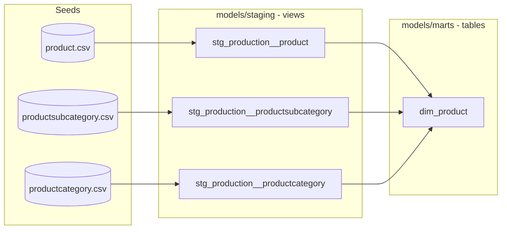

# Design: Modernize dbt-dimensional-model for Snowflake, staging layer, and SCD1/2/3 instruction

## Context

This repo is a personal fork (`ultramanguan/dbt-dimensional-model`) of the public "dbt dimensional
modelling" tutorial (originally `Data-Engineer-Camp/dbt-dimensional-modelling`, also featured on the
dbt developer blog). It teaches Kimball-style dimensional modelling using AdventureWorks CSV data
loaded via `dbt seed`.

Current state (audited 2026-09-19):

- `dbt-core==1.4.5` (2023), `dbt-postgres`, `dbt-duckdb` in `requirements.txt`; no `dbt-snowflake`.
- `profiles.yml` already targets `type: snowflake` (recently changed), but nothing else in the repo
  (docs, `.sqlfluff`, `requirements.txt`) reflects that yet — the project is in an inconsistent
  half-migrated state.
- No staging layer: `models/marts/*.sql` `ref()` seeds directly (e.g. `ref('product')`).
- No `sources.yml` — not needed, since raw data enters via `dbt seed`, not an external EL tool.
- `packages.yml` pins `dbt_utils` to an exact old version (`1.0.0`), no `package-lock.yml` committed.
- `snapshots/` folder exists but is empty. No SCD implementation of any kind.
- `docs/part01`–`part07` walk through: project setup (DuckDB/Postgres), identifying business
  processes, identifying facts/dimensions, building dimensions, building the fact table, documenting
  relationships, and consuming the model. No fundamentals doc (grain, fact table types, additive
  measures, conformed dimensions) and no SCD content anywhere.
- Model/seed `.yml` files use the deprecated `tests:` key (dbt-core has moved to `data_tests:`).
- Every seed used by a dimension (`person`, `address`, `product`, `store`, `customer`) has a
  `modifieddate` timestamp column, which makes a real timestamp-strategy SCD2 snapshot possible.
- `.sqlfluff` is configured for `dialect = duckdb` / `templater target = duckdb`.
- This sandbox has **no network access** (pip/PyPI and web fetches are both blocked by the proxy), so
  exact latest package versions can't be verified live during implementation. Version pins will use
  the most recent versions known from training data, called out explicitly so the user can bump them.

## Goals

1. Make the project internally consistent and current: Snowflake as the only compute target, current
   dbt-core/dbt-snowflake/dbt_utils versions, modern package-lock workflow, `data_tests:` syntax.
2. Introduce a staging layer between seeds and marts, following current dbt project-structure
   conventions.
3. Add real, runnable SCD2 instruction (dbt snapshot + historized mart), and SCD1/SCD3 as explained
   patterns with short illustrative snippets.
4. Add a data-modelling-fundamentals doc (grain, fact table types, additive/semi/non-additive
   measures, conformed/degenerate/junk dimensions, star vs. snowflake schema).
5. Add a beginner-oriented "how dbt works" doc, taught as a class for someone who has never used dbt:
   project anatomy, the DAG, materializations, and the parse/compile/execute run lifecycle.
6. Update existing docs part01–part07 in place (not full rewrites) to reflect the new structure and
   add detail/diagrams where the current text is thin.
7. Use Mermaid diagrams (native GitHub rendering, text-based) for new charts, matching the existing
   docs' habit of illustrating concepts visually.

## Non-goals

- No intermediate (`int_`) model layer — staging + marts only, per user decision.
- No multi-adapter support — Snowflake only, DuckDB/Postgres removed from docs and dependencies.
- SCD1 and SCD3 are not wired into the actual model pipeline as separate materialized models — they
  are taught via the existing dims (SCD1) and short standalone snippets (SCD3), per user decision.
- No CI/CD setup — out of scope for this pass.
- No renumbering of part01–part07 filenames (avoids breaking any external links to this fork); new
  docs are inserted as `part00-...`, `part00b-...`, and `part04b-...` with nav links updated.
- The dbt intro doc teaches dbt-the-tool generically (parse/compile/execute, DAG, materializations);
  it does not re-teach Kimball concepts (that's part00b's job) or Snowflake-specific setup (part01's).

## 1. Project structure: staging layer

New `models/staging/` layer, one subfolder per seed schema, mirroring the existing `seeds/` layout:

```
models/
├── staging/
│   ├── person/
│   │   ├── _person__models.yml
│   │   ├── stg_person__person.sql
│   │   ├── stg_person__address.sql
│   │   ├── stg_person__stateprovince.sql
│   │   └── stg_person__countryregion.sql
│   ├── production/
│   │   ├── _production__models.yml
│   │   ├── stg_production__product.sql
│   │   ├── stg_production__productsubcategory.sql
│   │   └── stg_production__productcategory.sql
│   ├── sales/
│   │   ├── _sales__models.yml
│   │   ├── stg_sales__customer.sql
│   │   ├── stg_sales__store.sql
│   │   ├── stg_sales__creditcard.sql
│   │   ├── stg_sales__salesorderheader.sql
│   │   ├── stg_sales__salesorderdetail.sql
│   │   ├── stg_sales__salesreason.sql
│   │   └── stg_sales__salesorderheadersalesreason.sql
│   └── date/
│       ├── _date__models.yml
│       └── stg_date__date.sql
└── marts/            (existing dim_*/fct_sales/obt_sales, ref()ing staging models instead of seeds)
```

Rules for staging models:
- One seed in, one staging model out. Only renaming (to clear, consistent snake_case business names)
  and type casting — no joins, no business logic, no surrogate keys.
- Materialized as `view`, landing in a `staging` schema (via `+materialized: view`, `+schema: staging`
  in `dbt_project.yml`; the existing `generate_schema_name` override means this resolves to literally
  `staging`, not `<target_schema>_staging`).
- Each staging model's natural key and important columns get `not_null`/`unique` tests declared once
  in `_<folder>__models.yml`, using `data_tests:`.

Marts change from `{{ ref('product') }}` to `{{ ref('stg_production__product') }}` etc. This is a
mechanical ref-swap; join logic and surrogate key generation in the marts stay the same.



## 2. Snowflake-only migration

- `requirements.txt`: remove `dbt-postgres`, `dbt-duckdb`; add `dbt-snowflake`; bump `dbt-core` and
  `sqlfluff`/`sqlfluff-templater-dbt` to current versions (pinned to the latest known-stable versions
  from training data — flagged with a comment for the user to verify/bump against PyPI, since this
  sandbox can't reach the network to check).
- `profiles.yml`: keep the `snowflake` target, switch credential fields to `env_var()` (account, user,
  password, role, database, warehouse, schema) instead of blank/plaintext values, with a comment
  noting key-pair auth as an alternative to password auth. Bump `threads` from `1` to a more usable
  default (e.g. `4`).
- `.sqlfluff`: `dialect = snowflake`, `templater:dbt target = dev` (matching profile target name).
- `docs/part01-setup-dbt-project.md`: rewritten setup steps for Snowflake only — creating a
  trial/dev Snowflake account, warehouse/database/schema/role, setting the env vars `profiles.yml`
  now expects, `dbt debug` to verify the connection — DuckDB/Postgres branches removed. Expanded with
  more detail than the current version (current doc is light on the "why" of each setup step).
- No `dbt_project.yml` quoting changes needed: seed/model identifiers are lowercase and unquoted,
  which Snowflake resolves case-insensitively (it upper-cases internally but matches unquoted
  references the same way) — call this out as a note in part01 rather than changing config.

## 3. Package management

- `packages.yml`: change `dbt_utils` from an exact pin (`1.0.0`) to a range (`[">=1.3.0", "<2.0.0"]`),
  matching current dbt Hub convention for package version constraints.
- Generate `package-lock.yml` by running `dbt deps` (must be done by the user or in a later step with
  network access — this sandbox can't reach the dbt Hub) and commit it, so the "package build way" is:
  edit `packages.yml` range → `dbt deps` regenerates/respects `package-lock.yml` → commit the lockfile
  for reproducible installs. Document this workflow in part01.

## 4. SCD1 / SCD2 / SCD3 instruction

New `docs/part04b-slowly-changing-dimensions.md`, inserted in the nav between part04 (create
dimensions) and part05 (create fact table) — part04's "Next" link and part05's "Previous" link are
updated to route through it.

Content outline:

1. **Why SCDs matter** — a dimension attribute changes in the source system; do we overwrite,
   version, or partially remember? Tie back to the business questions framing from part02/part03.
2. **Comparison table** (SCD1 vs 2 vs 3): what's kept, storage cost, query complexity, when to use
   each.
3. **SCD Type 1 — overwrite (no history)**
   - Explain that every dimension already built in part04 is technically Type 1: full-refresh `table`
     materialization means each `dbt run` reflects only the current source state.
   - Short snippet showing the production-scale version of the same idea: an `incremental` model with
     `unique_key` + `merge` strategy, so large dimensions don't need a full rebuild to stay Type 1.
   - Mermaid diagram: before/after showing a row being overwritten in place.
4. **SCD Type 2 — full history (working example)**
   - New `snapshots/scd_person_snapshot.sql`: a dbt snapshot over `stg_person__person`, `timestamp`
     strategy on `modifieddate`, `unique_key: businessentityid`.
   - New `models/marts/dim_customer_scd2.sql`: joins the snapshot to `stg_sales__customer` and
     `stg_sales__store`, carries `dbt_valid_from`/`dbt_valid_to` as the SCD2 validity window, and
     regenerates the surrogate key per version (hash of natural key + `dbt_valid_from`).
   - New `dim_customer_scd2.yml`: docs + `data_tests` (e.g. `dbt_utils.unique_combination_of_columns`
     on natural key + valid_from).
   - Step-by-step walkthrough: run `dbt seed && dbt snapshot && dbt run`, then edit a name in
     `person.csv` and bump its `modifieddate`, re-run `dbt seed && dbt snapshot && dbt run`, then
     query `dim_customer_scd2` to see two rows for the same customer with non-overlapping validity
     windows.
   - Mermaid timeline diagram showing one customer's two SCD2 rows with valid_from/valid_to.
5. **SCD Type 3 — limited history (previous-value column)**
   - Explained conceptually with a short, non-wired-in snippet: a self-referential incremental model
     pattern that adds a `previous_city_name` column by comparing the incoming row to `{{ this }}` and
     carrying the old value forward only when the tracked column changed.
   - Mermaid diagram: a single row gaining a `previous_x` column instead of a new row.

## 5. Intro to dbt doc (new)

New `docs/part00-intro-to-dbt.md`, positioned first in the reading order — before the modelling
fundamentals doc — since a reader can't usefully learn "how to model dimensionally in dbt" without
first knowing what dbt is and does. Written as a class for someone who has never touched dbt.

Content outline:

1. **What dbt is** — the "T" in ELT: a SQL+Jinja templating and orchestration layer that turns raw
   tables already sitting in a warehouse into modeled tables, by generating and running plain SQL
   against that warehouse. Contrast with traditional ETL (transform happens before loading, usually in
   a separate tool) to place dbt precisely.
2. **Project anatomy** — walk through this repo's own folders (`models/`, `seeds/`, `snapshots/`,
   `macros/`, `tests/`, `analyses/`) and what dbt does with each one, plus `dbt_project.yml` and
   `profiles.yml` as the two files that configure, respectively, the project and the connection.
3. **The DAG** — how a `{{ ref('some_model') }}` or `{{ source(...) }}` call is both how you write SQL
   *and* how dbt learns the dependency graph; no separate "orchestration config" is needed. Mermaid
   diagram of this project's actual DAG once staging exists (seeds → staging views → mart tables).
4. **Materializations** — `view`, `table`, `incremental`, `ephemeral`: what SQL each one literally
   compiles to and executes on Snowflake (e.g. `table` → `create or replace table as select`,
   `incremental` → `merge`/`insert` against existing data), so the abstraction doesn't feel magical.
5. **What happens when you type `dbt run`** — three phases: **parse** (read every file, resolve
   `ref`/`source` calls, build the in-memory manifest/DAG), **compile** (render Jinja to plain SQL per
   node, written to `target/compiled/...`), **execute** (send compiled SQL to Snowflake via the
   `dbt-snowflake` adapter, in DAG order, respecting `threads` for parallelism; results recorded to
   `target/run_results.json`). Mermaid sequence/flow diagram of this lifecycle.
6. **Core CLI commands** — `dbt deps`, `dbt seed`, `dbt run`, `dbt test`, `dbt snapshot`, `dbt build`
   (runs seed+run+test+snapshot together in DAG order), `dbt docs generate`/`serve`, `dbt debug` — one
   or two sentences each on what it does under the hood, referencing the parse/compile/execute model
   from step 5.
7. **dbt Core vs. dbt Cloud** — brief note that this project uses dbt Core (the open-source CLI, run
   locally or in your own CI), and that dbt Cloud is a separate hosted product with a scheduler/IDE on
   top of the same underlying engine — enough to avoid confusion when the reader searches for help
   online and finds dbt Cloud screenshots.
8. Hand-off line into part00b: "Now that you know what dbt does, let's look at *what* we're going to
   ask it to build."

## 6. Data modelling fundamentals doc

New `docs/part00b-data-modeling-fundamentals.md`, linked in the README ToC right after the new intro
to dbt doc (before part01), and as part01's new "Previous" link (replacing the direct link to
`../README.md`).

Content outline (expanding on the brief blurb currently only in `README.md`):

- OLTP vs. OLAP: why the source schema (3NF) isn't what analysts should query directly.
- Grain: the single most important decision in dimensional modelling — defined with a concrete
  AdventureWorks example (one row per order line, not per order).
- Fact table types: transaction, periodic snapshot, accumulating snapshot — with a Mermaid diagram
  contrasting their row-per-event timing.
- Measures: additive, semi-additive, non-additive — with examples from `fct_sales`.
- Dimension patterns: conformed, degenerate, junk dimensions — referencing where (if anywhere) these
  show up in the AdventureWorks model.
- Star vs. snowflake schema — reusing/cross-linking the existing `star-schema.png`/
  `snowflake-schema.png` images already in `docs/img/`, plus a new Mermaid ER-style diagram of this
  project's actual star schema (`fct_sales` + its dimensions) for a concrete, current reference.

## 7. Testing syntax modernization

Mechanical rename of `tests:` → `data_tests:` in every model and seed `.yml` file (deprecated key in
current dbt-core). No behavior change.

## Files touched (summary)

**New:**
- `docs/part00-intro-to-dbt.md`
- `docs/part00b-data-modeling-fundamentals.md`
- `docs/part04b-slowly-changing-dimensions.md`
- `models/staging/**` (13 staging `.sql` models + 4 `_*.yml` docs files)
- `snapshots/scd_person_snapshot.sql`
- `models/marts/dim_customer_scd2.sql` + `dim_customer_scd2.yml`
- `package-lock.yml` (generated via `dbt deps`, requires network — flagged as a follow-up step)

**Edited:**
- `requirements.txt`, `profiles.yml`, `.sqlfluff`, `packages.yml`, `dbt_project.yml`
- `models/marts/*.sql` (ref-swap to staging models)
- All existing model/seed `.yml` files (`tests:` → `data_tests:`)
- `docs/part01-setup-dbt-project.md` (Snowflake-only rewrite + package-lock workflow)
- `docs/part04-create-dimension.md`, `docs/part05-create-fact.md` (nav links to part04b)
- `README.md` (ToC entries for part00, part00b, and part04b)
- Possibly light touch-ups to `docs/part02`, `part03`, `part06`, `part07` if they reference seeds
  directly or need a pointer to the new fundamentals/SCD content — confirmed during implementation by
  re-reading each file, not rewritten wholesale.

## Open risk / caveat to flag to the user again

Exact latest versions of `dbt-core`, `dbt-snowflake`, `dbt_utils`, and `sqlfluff` cannot be verified
from this sandbox (no network access to PyPI/dbt Hub). Pins will use the most recent versions known
from training data with a clear comment to double check before running `pip install`/`dbt deps`.
